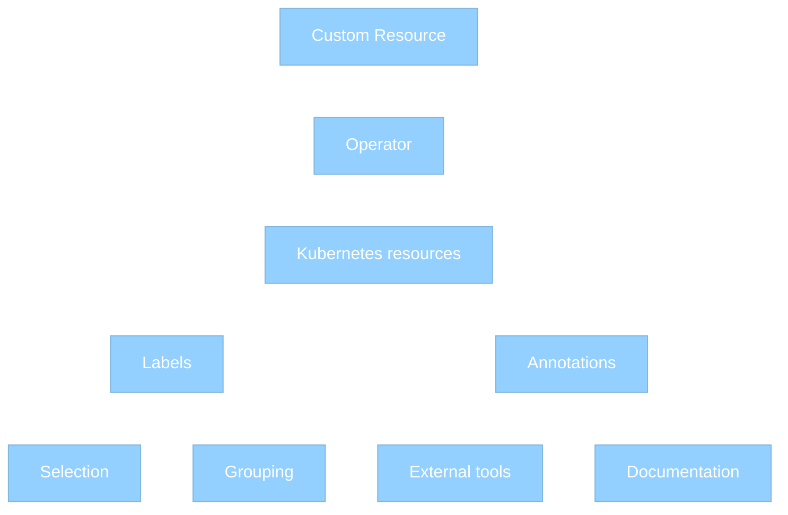

# Labels and annotations

[Labels :octicons-link-external-16:](https://kubernetes.io/docs/concepts/overview/working-with-objects/labels/)
and [annotations :octicons-link-external-16:](https://kubernetes.io/docs/concepts/overview/working-with-objects/annotations/)
are used to attach additional metadata information to Kubernetes resources.

Labels and annotations are rather similar but differ in purpose.

**Labels** are used by Kubernetes to identify and select objects. They enable filtering and grouping, allowing users to apply selectors for operations like deployments or scaling.

**Annotations** are assigning additional *non-identifying* information that doesn't affect how Kubernetes processes resources. They store descriptive information like deployment history, monitoring configurations or external integrations.

The following diagram illustrates this difference:




Both Labels and Annotations are assigned to the following objects managed by Percona Operator for PostgreSQL:

* Custom Resource Definitions
* Custom Resources
* Deployments
* Services
* StatefulSets
* PVCs
* Pods
* ConfigMaps and Secrets

## When to use labels and annotations

Use **Labels** when:

* The information is used for object selection
* The data is used for grouping or filtering
* The information is used by Kubernetes controllers
* The data is used for operational purposes

Use **Annotations** when:

* The information is for external tools
* The information is used for debugging
* The data is used for monitoring configuration

## Labels and annotations used by Percona Operator for PostgreSQL

### Labels

| Name                        | Objects                          | Description                                      | Example values                          |
|-----------------------------|-----------------------------------|------------------------------------------------|-----------------------------------------|
| `pgv2.percona.com/version`  | CustomResourceDefinition          | Specifies the version of the Percona Operator for PostgreSQL. | {{release}} |
| `app.kubernetes.io/instance`  | Services, StatefulSets, Deployments | Identifies a specific instance of the application | cluster1 |
| `app.kubernetes.io/managed-by`| Services, StatefulSets           | Indicates the controller managing the object    | percona-postgresql-operator |
| `app.kubernetes.io/component`| Services, StatefulSets           | Specifies the component within the application  | postgres, pgbouncer, pgbackrest                 |
| `app.kubernetes.io/part-of`   | Services, StatefulSets           | Indicates the higher-level application the object belongs to | percona-postgresql                          |
| `app.kubernetes.io/name`| Services, StatefulSets, Deployments, etc. | Specifies the name of the application | percona-postgresql | 
| `postgres-operator.crunchydata.com/cluster`      | StatefulSets, Deployments, Services, PVCs | Specifies the name of the application          | cluster1  |
| `postgres-operator.crunchydata.com/instance`  | Services, StatefulSets, Deployments | Identifies a specific instance of the application | cluster1 |
| `postgres-operator.crunchydata.com/instance-set` | Pods, StatefulSets | Describes the set of instances (such as a group of pods) within the PostgreSQL cluster. |
| `postgres-operator.crunchydata.com/name` | pgBackRest resources (Jobs, CronJobs, Deployments, PVCs, etc.) | Used to specify the name of a pgBackRest repository. |
|`postgres-operator.crunchydata.com/patroni`| Pods, StatefulSets | Indicates Patroni-related resources.|
| `postgres-operator.crunchydata.com/role`| Pods, PVCs, Services | The role that Patroni sets on the Pod that is currently the leader|
| `postgres-operator.crunchydata.com/cluster-certificate`| Secrets | Identifies a secret containing a cluster certificate| postgres-tls|
| `postgres-operator.crunchydata.com/data`| Pods, PVCs | Identifies Pods and Volumes that store Postgres data|
| `postgres-operator.crunchydata.com/move-job`      | Jobs |Identifies a directory move Job.  |                      | 
| `postgres-operator.crunchydata.com/move-pgbackrest-repo-dir` | Jobs                     | Identifies a Job moving a pgBackRest repo directory.                | |
| `postgres-operator.crunchydata.com/move-pgdata-dir` | Jobs                     | Identifies a Job moving a pgData directory.  | | 
| `postgres-operator.crunchydata.com/move-pgwal-dir` | Jobs                     | Identifies a Job moving a pg_wal directory.                            |
| `postgres-operator.crunchydata.com/pgbackrest`    | pgBackRest resources     | Indicates a resource that is for pgBackRest.                                    |
| `postgres-operator.crunchydata.com/pgbackrest-backup` | Backup Jobs              | Indicates a resource that is for a pgBackRest backup.                     |
| `postgres-operator.crunchydata.com/pgbackrest-config` | ConfigMaps, Secrets      | Indicates a ConfigMap/Secret for pgBackRest.                     |
| `postgres-operator.crunchydata.com/pgbackrest-dedicated` | ConfigMaps               | Indicates a ConfigMap that is for a dedicated pgBackRest repo host.                 |
| `postgres-operator.crunchydata.com/pgbackrest-repo` | Deployments, Pods        | Indicates a Deployment or a Pod for a pgBackRest repo.      | The name of the repository you define in CR   |
| `postgres-operator.crunchydata.com/pgbackrest-volume` | PVCs     | Indicates a PVC for a pgBackRest repo volume.                |
| `postgres-operator.crunchydata.com/pgbackrest-cronjob` | CronJobs                 | Indicates a resource is a pgBackRest CronJob.                      |
| `postgres-operator.crunchydata.com/pgbackrest-restore` | Jobs, Pods               | Indicates a Job/Pod for a pgBackRest restore.                   |
| `postgres-operator.crunchydata.com/pgbackrest-restore-config` | ConfigMaps, Secrets      | Indicates a a configuration resource (e.g. a ConfigMap or Secret) for pgBackRest restore.         |
| `postgres-operator.crunchydata.com/crunchy-postgres-exporter` | Pods                     | Added to Pods running the exporter container for Prometheus discovery. |
| `postgres-operator.crunchydata.com/pguser`        | Secrets, Users           | Identifies the PostgreSQL user an object is for/about.                     | Username |
| `postgres-operator.crunchydata.com/startup-instance` | Pods, Jobs               | Indicates the startup instance associated with a resource.  |
| `postgres-operator.crunchydata.com/cbc-pgrole`    | Secrets                  | Identifies a CBC PostgreSQL role secret.                                   |
| `postgres-operator.crunchydata.com/pgadmin`       | pgAdmin resources        | Indicates a resource for a standalone pgAdmin instance.                     |


### Annotations

| Name                                              | Objects  | Description                                   | Example Values              |
|---------------------------------------------------|----------|-----------------------------------------------|-----------------------------|
| `postgres-operator.crunchydata.com/trigger-switchover` | Custom Resource | Initiates a failover, switchover |             |
| `postgres-operator.crunchydata.com/pgbackrest-backup`         | Custom Resource, Backup | Initiates a manual backup | timestamp                  |
| `postgres-operator.crunchydata.com/pgbackrest-backup-job-completion`         | Restore, PVC | Added to restore jobs, pvcs, and VolumeSnapshots that are involved in the volume snapshot creation process. The annotation holds a RFC3339 formatted timestamp that corresponds to the completion time of the associated backup job. | timestamp                  |
| `postgres-operator.crunchydata.com/pgbackrest-hash`         | Custom Resource | Specifies the hash value associated with a repo configuration as needed to detect configuration changes that invalidate running Jobs (and therefore must be recreated) |                   |
| `postgres-operator.crunchydata.com/pgbackrest-restore`         | Custom Resource | Initiates an in-place restore|  timestamp|
| `postgres-operator.crunchydata.com/pgbackrest-ip-version`         | Custom Resource | Indicates whether to use an IPv6 wildcard address for the pgBackRest "tls-server-address". Set the value "IPv6" to use an IPv6 addresses. If the annotation is not present of has a value other than IPv6, it defaults to IPv4 (0.0.0.0). |  0.0.0.0 |
| `postgres-operator.crunchydata.com/postgres-exporter-collectors` | Pods                 | Specifies which collectors to enable for the exporter. The value "None" disables all postgres_exporter defaults. Disabling the defaults may cause errors in dashboards.    | `database,table`  |
| `postgres-operator.crunchydata.com/adopt-bridge-cluster`    | CrunchyBridgeCluster Custom Resource    | Allows users to "adopt" or take control over an existing Bridge Cluster with a CrunchyBridgeCluster Custom Resource. Essentially, if a CrunchyBridgeCluster Custom Resource does not have a status.ID, but the name matches the name of an existing bridge cluster, the user must add this annotation to the Custom Resource to allow it to take control of the Bridge Cluster. The Value assigned to the annotation must be the ID of existing cluster.             | existing cluster ID                       |
| `postgres-operator.crunchydata.com/autoCreateUserSchema`    | Custom Resource         | Controls if the Operator should create schemas for the users defined in `spec.users` for all of the databases listed for that user| `true`|
| `postgres-operator.crunchydata.com/authorizeBackupRemoval`  | Custom Resource  | Allows removal of PVC-based backups when changing from a cluster with backups to a cluster without backups. Backups stored on the cloud storage are intact  | `true`                       |
| `postgres-operator.crunchydata.com/override-config`         | ConfigMaps                 | Used to override default configuration from a ConfigMap.   | `custom-config`              |
| `pgv2.percona.com/monitor-user-secret-hash`                 | Custom Resource       | Hash of the monitor user secret, used to detect changes and trigger updates. | `b6e1a2c3...` |
| `pgv2.percona.com/backup-in-progress`                       | Custom Resource        | Indicates a backup that is currently running for the cluster.                     | `true`                       |
| `pgv2.percona.com/cluster-bootstrap-restore`                | Custom Resource       | Marks that the cluster was bootstrapped from a restore.                      | `2024-07-01T12:34:56Z`       |
| `pgv2.percona.com/patroni-version`                          | Pods, StatefulSets         | The Patroni version running in the Pod or StatefulSet.                       | `3.3.0`                      |
| `pgv2.percona.com/custom-patroni-version`                   | Pods, StatefulSets         | Custom Patroni version specified by the user.                                | `3.3.0-percona`              |
| `kubectl.kubernetes.io/default-container` | Pods | Defines a default container used when the
`-c` flag is not passed when executing to a Pod.|

## Setting labels and annotations in the Custom Resource

You can define both Labels and Annotations as `key-value` pairs in the metadata section of a YAML manifest for a specific resource.

### Set labels and annotations for Pods

For PostgreSQL, pgBouncer and pgBackRest Pods,
use `instances.metadata.annotations`/`instances.metadata.labels`,
`proxy.pgbouncer.metadata.annotations`/`proxy.pgbouncer.metadata.labels`, or
`backups.pgbackrest.metadata.annotations`/`backups.pgbackrest.metadata.labels`
keys as follows:

```yaml
apiVersion: pgv2.percona.com/v2
kind: PerconaPGCluster
...
spec:
...
  instances:
   - name: instance1
     replicas: 3
     metadata:
      annotations:
        my-annotation: value1
      labels:
        my-label: value2
    ...
```

### Set Set labels and annotations for Services

For PostgreSQL and pgBouncer Services, use `expose.annotations`/`expose.labels` or
`proxy.pgbouncer.expose.annotations`/`proxy.pgbouncer.expose.labels` keys as
follows:

```yaml
apiVersion: pgv2.percona.com/v2
kind: PerconaPGCluster
...
spec:
  ...
  expose:
    annotations:
      my-annotation: value1
    labels:
      my-label: value2
    ...
```

### Set global labels and annotations

You can also use the top-level spec `metadata.annotations` and `metadata.labels`
options to set annotations and labels at a global level, for all resources
created by the Operator:

```yaml
apiVersion: pgv2.percona.com/v2
kind: PerconaPGCluster
...
spec:
  ...
  metadata:
    annotations:
      my-global-annotation: value1
    labels:
      my-global-label: value2
  ...
```

## Settings labels and annotations for the Operator Pod

You can assign labels and/or annotations to the Operator itself by
editing the [deploy/operator.yaml configuration file :octicons-link-external-16:](https://github.com/percona/percona-server-mongodb-operator/blob/main/deploy/operator.yaml)
before [applying it during the installation](kubernetes.md). This way you add labels and annotations to the Pod where the Operator is running

```yaml
apiVersion: apps/v1
kind: Deployment
...
spec:
...
  template:
    metadata:
      labels:
        app.kubernetes.io/component: operator
        app.kubernetes.io/instance: percona-postgresql-operator
        app.kubernetes.io/name: percona-postgresql-operator
        app.kubernetes.io/part-of: percona-postgresql-operator
        pgv2.percona.com/control-plane: postgres-operator
        ...
```

## Querying labels and annotations

To check which **labels** are attached to a specific object, use the additional `--show-labels` option of the `kubectl get` command.

For example, to see the Operator version associated with a Custom Resource Definition, use the following command:

```{.bash data-prompt="$"}
kubectl get crd perconapgclusters.pgv2.percona.com --show-labels
```

??? example "Sample output"

    ```{.text .no-copy}
    NAME                                 CREATED AT             LABELS
perconapgclusters.pgv2.percona.com   2025-07-01T13:13:36Z   pgv2.percona.com/version=v{{release}}
    ```

To check **annotations** associated with an object, use the following command:

``` {.bash data-prompt="$" }
kubectl get <resource> <resource-name> -o jsonpath='{.metadata.annotations}'
```

For example, this command lists annotations assigned to a `cluster1-pgbouncer` Service:

``` {.bash data-prompt="$" }
kubectl get service cluster1-instance1-xvbt-0 -o jsonpath='{.metadata.annotations}'
```

??? example "Sample output"

    ```{.json .no-copy}
    {
      "cloud.google.com/neg": "{\"ingress\":true}"
    }
    ```
    
## Special annotations

Metadata can be used as an additional way to influence the Operator behavior by setting special annotations.

### Customizing Patroni version

Starting from the Operator 2.6.0, Percona distribution for PostgreSQL comes with Patroni 4.x, which introduces breaking changes compared to previously used 3.x versions. To maintain backward compatibility, the Operator needs to detect the Patroni version used in the image. For this, it runs a temporary Pod named `cluster_name-patroni-version-check` with the following default resources:

```yaml
Resources:
   Requests:
     memory: 32Mi
     cpu: 50m
   Limits:
     memory: 64Mi
     cpu: 100m
```

You can disable this auto-detection feature by manually setting the Patroni version via the following annotation in the metadata part of the Custom Resource (it should contain "4" for Patroni 4.x or "3" for Patroni 3.x):

```yaml
apiVersion: pgv2.percona.com/v2
kind: PerconaPGCluster
metadata:
  name: cluster1
  annotations:
    pgv2.percona.com/custom-patroni-version: "4"
  ...
```


