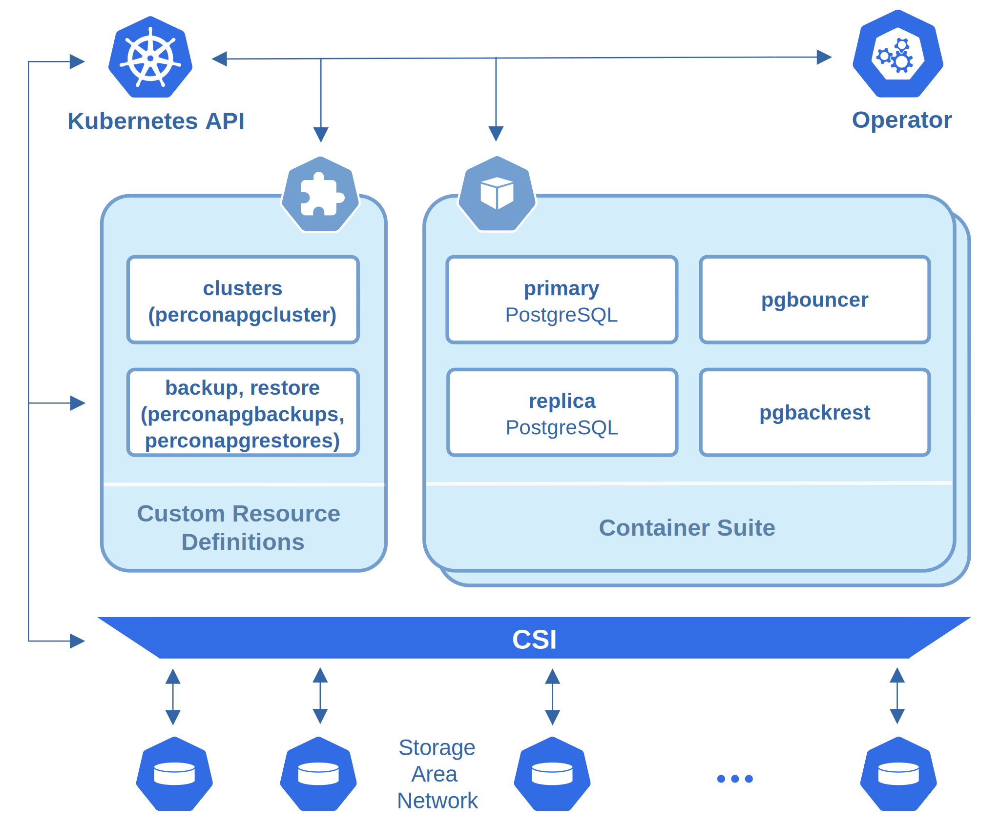

# Design overview

The Percona Operator for PostgreSQL automates and simplifies
deploying and managing open source PostgreSQL clusters on Kubernetes.
The Operator is based on [CrunchyData’s PostgreSQL Operator :material-arrow-top-right:](https://access.crunchydata.com/documentation/postgres-operator/v5/).

PostgreSQL containers deployed with the Operator include the following components:

* The [PostgreSQL :material-arrow-top-right:](https://www.postgresql.org/) database management system, including:

    * [PostgreSQL Additional Supplied Modules :material-arrow-top-right:](https://www.postgresql.org/docs/current/contrib.html),

    * [pgAudit :material-arrow-top-right:](https://www.pgaudit.org/) PostgreSQL auditing extension,

    * [PostgreSQL set_user Extension Module :material-arrow-top-right:](https://github.com/pgaudit/set_user),

    * [wal2json output plugin :material-arrow-top-right:](https://github.com/eulerto/wal2json),

* The [pgBackRest :material-arrow-top-right:](https://pgbackrest.org/) Backup & Restore utility,

* The [pgBouncer :material-arrow-top-right:](http://pgbouncer.github.io/) connection pooler for PostgreSQL,

* The PostgreSQL high-availability implementation based on the [Patroni template :material-arrow-top-right:](https://patroni.readthedocs.io/),

* the [pg_stat_monitor :material-arrow-top-right:](https://github.com/percona/pg_stat_monitor/) PostgreSQL Query Performance Monitoring utility,

* LLVM (for JIT compilation).

To provide high availability the Operator involves [node affinity :material-arrow-top-right:](https://kubernetes.io/docs/concepts/configuration/assign-pod-node/#affinity-and-anti-affinity)
to run PostgreSQL Cluster instances on separate worker nodes if possible. If
some node fails, the Pod with it is automatically re-created on another node.

To provide data storage for stateful applications, Kubernetes uses
Persistent Volumes. A *PersistentVolumeClaim* (PVC) is used to implement
the automatic storage provisioning to pods. If a failure occurs, the
Container Storage Interface (CSI) should be able to re-mount storage on
a different node.

The Operator functionality extends the Kubernetes API with [Custom Resources
Definitions :material-arrow-top-right:](https://kubernetes.io/docs/concepts/extend-kubernetes/api-extension/custom-resources/#customresourcedefinitions).
These CRDs provide extensions to the Kubernetes API, and, in the case of the
Operator, allow you to perform actions such as creating a PostgreSQL Cluster,
updating PostgreSQL Cluster resource allocations, adding additional utilities to
a PostgreSQL cluster, e.g. [pgBouncer :material-arrow-top-right:](https://www.pgbouncer.org/) for
connection pooling and more.

When a new Custom Resource is created or an existing one undergoes some changes
or deletion, the Operator automatically creates/changes/deletes all needed
Kubernetes objects with the appropriate settings to provide a proper Percona
PostgreSQL Cluster operation.

Following CRDs are created while the Operator installation:

* `perconapgclusters` stores information required to manage a PostgreSQL cluster.
This includes things like the cluster name, what storage and resource classes
to use, which version of PostgreSQL to run, information about how to maintain
a high-availability cluster, etc.

* `perconapgbackups` and `perconapgrestores` are in charge for making backups
    and restore them.

