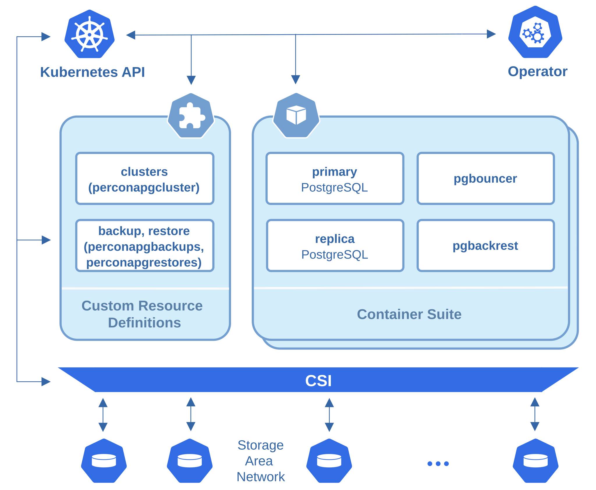

# Architecture

This document provides a high-level overview of Percona Operator for PostgreSQL architecture, explaining how the various components connect to create a production-ready PostgreSQL cluster on Kubernetes. See also [How the Operator works](operator-how-it-works.md).

## Components 

The Operator components are the following:

* [**Percona Distribution for PostgreSQL** :octicons-link-external-16:](https://docs.percona.com/postgresql/latest/index.html) - a suite of open source software, tools and services required to deploy and maintain a reliable production cluster for PostgreSQL. It includes the set of extensions such as [pgAudit :octicons-link-external-16:](https://www.pgaudit.org/) for audit logging, [`pg_stat_monitor` :octicons-link-external-16:](https://docs.percona.com/pg-stat-monitor/index.html) for query performance statistics and [additional supplied modules and extensions :octicons-link-external-16:](https://www.postgresql.org/docs/current/contrib.html). It also comes with LLVM library for JIT compilation.
  
* [**Patroni** :octicons-link-external-16:](https://patroni.readthedocs.io/) - a high-availability solution for PostgreSQL that automates replication and **failover**. It maintains the cluster state and coordinates leader election to ensure that a healthy primary node is always available. Patroni simplifies building and operating resilient PostgreSQL clusters by handling node monitoring, failover, and recovery automatically. 

* [**pgBouncer** :octicons-link-external-16:](http://pgbouncer.github.io/) is a **lightweight connection pooler** in front of PostgreSQL. It sits between client applications and the database server to manage and reuse connections efficiently. Instead of each client opening its own database connection, pgBouncer maintains a pool of connections and serves them to clients on demand, significantly reducing connection overhead and improving performance, especially for applications with many short-lived or concurrent connections.

* [**pgBackRest** :octicons-link-external-16:](https://pgbackrest.org/) is a backup and restore tool. It handles **full, incremental, and differential** backups, compression and encryption, parallel processing, and point-in-time recovery using WAL archives. 
  
* **PMM Client for observability** – The PMM Client is an optional, yet valuable, component that you can enable to gain deeper insights into your database performance. When monitoring is [configured](monitoring.md), the PMM Client is deployed as a sidecar container alongside PostgreSQL Pods, empowering you with detailed monitoring and management capabilities.

* **Log collector for persistent logging** – An optional Fluent Bit–based log collector that runs as `logs` and `logrotate` sidecar containers on PostgreSQL instance Pods. It tails PostgreSQL and pgBackRest client logs on the data volume so they remain available across Pod restarts, ships them to the sidecar’s standard output (default) or to your custom endpoint, and rotates on-disk log files to control volume growth. See [Persistent logging](persistent-logging.md) and [Log rotation](log-rotation.md).

### How components work together

This workflow shows how cluster components work together:

1. Your **application** connects through a Kubernetes **Service** that routes the traffic to pgBouncer.
2. **pgBouncer** accepts many client connections and forwards them through a smaller set of server connections to PostgreSQL Pods.
3. **PostgreSQL** executes queries. **Writes** go to the **primary**. **Reads** can target the primary or **replicas**.
4. Primary streams WAL to replicas via instance Services
5. Patroni monitors the cluster state and coordinates the leader elections if the primary node fails
6. pgBackRest makes backups according the schedule that you defined or when you manually create a backup object. pgBackRest saves backups to the backup storage your configured. To learn more about backups, their workflow and setup, refer to the [About backups](backups.md)
7. PMM Client collects performance metrics and sends them to the PMM Server for you to see and analyze. See [Monitor the database with PMM](monitoring.md) to learn more.
8. When [persistent logging](persistent-logging.md) is enabled, the `logs` sidecar reads PostgreSQL and pgBackRest client logs from the instance data volume and ships them. The paired `logrotate` sidecar keeps on-disk log growth under control. See [Log rotation](log-rotation.md).

## Default cluster configuration

The default Percona Distribution for PostgreSQL configuration includes:

* 3 PostgreSQL servers, one primary and two replicas.
* 3 pgBouncer instances.
* a pgBackRest repository host instance – a dedicated instance in your cluster that stores filesystem backups made with pgBackRest.
* (optional) a PMM client instance - a monitoring and management tool for PostgreSQL that provides a way to monitor your database health and performance. PMM Client is disabled by default and runs as a sidecar container in the database Pods when you [configure monitoring](monitoring.md)
* `logs` and `logrotate` sidecar containers on PostgreSQL instance Pods collect PostgreSQL and pgBackRest logs that persist across Pod restarts. Enabled by default for new clusters. See [configure persistent logging](persistent-logging.md) for steps to enable persistent logging on existing deployments.

### Primary, replicas, and high availability

Each PostgreSQL cluster has **one primary** instance that accepts read/write transactions. **Replicas** are standbys: they replicate from the primary and typically serve **read-only** traffic (depending on how you expose them).

The Operator provides high availability through multiple layers of protection:

#### Pod distribution

The Operator uses [node affinity and anti-affinity :octicons-link-external-16:](https://kubernetes.io/docs/concepts/configuration/assign-pod-node/#affinity-and-anti-affinity) to distribute PostgreSQL instances across separate worker nodes when possible. This prevents a single node failure from taking down multiple database instances.

#### Automatic recovery

If a node fails, Kubernetes automatically reschedules the affected Pod on another healthy node. Patroni handles which PostgreSQL instance is primary and ensures replication continuity. For more on HA behavior and operations, see [High-availability](ha-deploy.md).

## Storage and persistent volumes

Stateful applications require their data to persist even if Pods are restarted or rescheduled. In Kubernetes, this is achieved through **PersistentVolumeClaims (PVCs)**, which request storage resources. The cluster’s CSI driver provisions **PersistentVolumes**, and can **reattach** storage if a Pod moves to another
node, thereby ensuring data continuity.

If a node fails, the expectation is that the volume can be mounted elsewhere and the Pod recreated, while Patroni and PostgreSQL recover the database layer. When [persistent logging](persistent-logging.md) is enabled, PostgreSQL and pgBackRest log files also live on the instance data volume, so log history survives Pod restarts the same way database data does. For storage troubleshooting, see [Check storage](debug-storage.md).

## Next steps 

For a comparison of Percona’s approach with other deployment models, see [Comparison with other solutions](compare.md).
