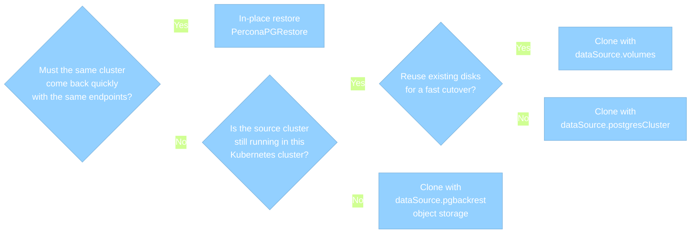

# Restore options: in-place restore vs cluster clone

You can restore PostgreSQL data in these ways:

* [**In-place restore**](backups-restore-inplace.md) – restore
data into the same cluster using the [PerconaPGRestore]
(restore-options.md) custom resource. By default, the Operator
restores the most recent backup. You can specify what backup to
restore from using the `--set` option.
* [**Cluster clone**](backups-clone.md) – create a new cluster using the `spec.dataSource` option in the Custom
Resource of a **new** cluster. The data source can be a source cluster (`postgresCluster`), its data volume (`volumes`) or a `pgBackrest` backup from a cloud storage (`pgbackrest`).

Both approaches support full restore. For a restore to a specific moment, see [Point-in-time recovery](backups-pitr.md).
Choose the method that fits your scenario.

## Choose a restore option

Use this flow to pick a restore path:

| Restore option | When to use | Pros | Cons |
| --- | --- | --- | --- |
| [In-place restore](backups-restore-inplace.md) | - Roll the **same** cluster back after a bad migration, accidental `DELETE`/`DROP` or data corruption   - You need service restored quickly on the existing endpoints | - Keeps the same cluster name, Services, and app connection strings   - Simple to run   - Supports full restore and [point-in-time recovery](backups-pitr-inplace.md) | - **Destructive** — overwrites live data;   - Introduces downtime;   - No side-by-side validation;   - A failed restore can leave the cluster non-operational |
| [Cluster clone](backups-clone.md) | - Create a **side** cluster to test disaster recovery, investigate or recover without touching production data;   - Spin up a copy for reporting, or rebuild when the source is gone | - Source stays intact for backup-based clones;   - You can validate restored data before cutover;   - Safer default for most recovery scenarios;   - Supports [point-in-time recovery](backups-pitr-cluster-clone.md) | - Needs extra cluster resources and storage;   - Apps must switch endpoints for cutover;   - Restore from cloud-based backups takes time |

## If you clone: choose a data source

| Method | When to use | Pros | Cons |
| --- | --- | --- | --- |
| [`dataSource.postgresCluster`](backups-clone.md#datasourcepostgrescluster) | - Source still runs in this Kubernetes cluster;   - You want a side copy in the same or another namespace | - Easiest clone when the source exists;   - supports [point-in-time recovery](backups-pitr-cluster-clone.md);   - source stays untouched | - Source must be available;   - Doesn't apply for a deleted cluster or another Kubernetes cluster;   - Needs restore time and a full data copy |
| [`dataSource.pgbackrest`](backups-clone.md#datasourcepgbackrest) | Source is deleted, you restore into another Kubernetes cluster, or you only have object-storage backups | - Works without a live source;   - Fits multi-cluster disaster recovery scenarios | - You must match path, stanza, Secret, and storage settings;   - Restore time and network cost |
| [`dataSource.volumes`](backups-clone.md#datasourcevolumes) | - Same-infrastructure cutover on existing disks;   - Large dataset where a backup restore is too slow | - Fastest bootstrap;   - No object storage required for the cutover | - Source must stop;   - Weak rollback after the new cluster writes |

## Next steps

[In-place restore](backups-restore-inplace.md){.md-button}
[Cluster clone](backups-clone.md){.md-button}

