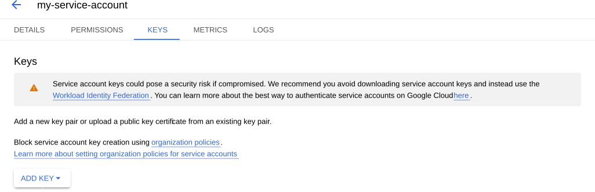

# Google Cloud Storage

To use [Google Cloud Storage (GCS) :octicons-link-external-16:](https://cloud.google.com/storage) for backups, configure a pgBackRest repository in `backups.pgbackrest.repos` and provide:

* A GCS bucket name which you will reference in the `gcs.bucket` option under the repository entry
* A Google service account key, which the Operator will use to access the storage. 
  
## Configuration steps {.power-number}

The following example configuration uses the `repo3` repository name.

1. Create a service account key following the [Google Cloud instructions :octicons-link-external-16:](https://cloud.google.com/iam/docs/creating-managing-service-account-keys).

2. Download the key from the Google Cloud console (*IAM & Admin* → *Service Accounts* → your account → *KEYS* → *ADD KEY* → *Create new key* → *JSON*). The downloaded file is typically named `gcs-key.json`.

    

3. Prepare the Secret data:

    * Create `gcs.conf` for repository `repo3`:

        ```
        [global]
        repo3-gcs-key=/etc/pgbackrest/conf.d/gcs-key.json
        ```

    * Encode both `gcs-key.json` and `gcs.conf` files using base64:

        === ":simple-linux: Linux"

            ```bash
            base64 --wrap=0 <filename>
            ```

        === ":simple-apple: macOS"

            ```bash
            base64 -i <filename>
            ```

    * Create the Secret manifest. For example, `cluster1-pgbackrest-secrets.yaml`:

        ```yaml
        apiVersion: v1
        kind: Secret
        metadata:
          name: cluster1-pgbackrest-secrets
        type: Opaque
        data:
          gcs-key.json: <base64-encoded-json-file-contents>
          gcs.conf: <base64-encoded-conf-file-contents>
        ```

        You can store credentials for several repositories in one Secret by adding separate data keys.

4. Apply the Secret. Replace `<namespace>` with your namespace:

    ```bash
    kubectl apply -f cluster1-pgbackrest-secrets.yaml -n <namespace>
    ```

5. Update `deploy/cr.yaml` Custom Resource manifest:
    
    * Reference the Secret in `backups.pgbackrest.configuration`
    * Provide the backup path in [backups.pgbackrest.global](operator.md#backupspgbackrestglobal) with the pgBackRest `path` option. The repository name must match the name in `gcs.conf` (`repo3-path` in this example) 
    * Define the GCS bucket under `repos`. 

       ```yaml
       ...
       backups:
         pgbackrest:
           ...
           configuration:
             - secret:
                 name: cluster1-pgbackrest-secrets
           ...
           global:
             repo3-path: /pgbackrest/postgres-operator/cluster1/repo3
           ...
           repos:
           - name: repo3
             gcs:
               bucket: "<YOUR_GCS_BUCKET_NAME>"
       ```

6. Apply the cluster Custom Resource. Replace the `<namespace>` placeholder with your value:

    ```bash
    kubectl apply -f deploy/cr.yaml -n <namespace>
    ```

## Next steps

[Make an on-demand backup](backups-ondemand.md){.md-button}
[Make a scheduled backup](backups-schedule.md){.md-button}

