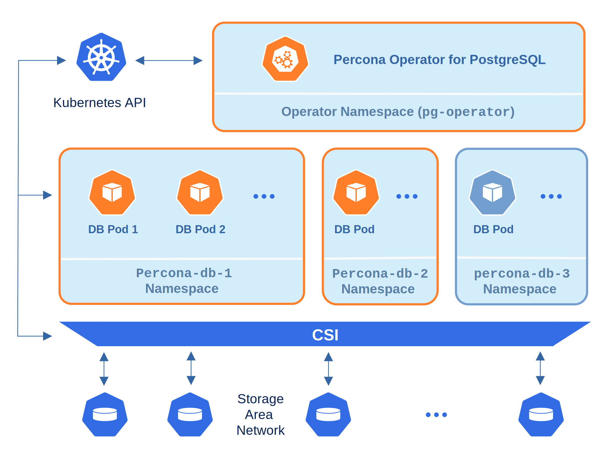

# Percona Operator for PostgreSQL single-namespace and multi-namespace deployment

There are two design patterns that you can choose from when deploying Percona Operator for PostgreSQL and PostgreSQL clusters in Kubernetes:


* Namespace-scope - one Operator per Kubernetes namespace,


* Cluster-wide - one Operator can manage clusters in multiple namespaces.

This how-to explains how to configure Percona Operator for PostgreSQL for each scenario.

## Namespace-scope

By default, Percona Operator for PostgreSQL functions in a specific Kubernetes namespace. You can
create default `pgo` one or some other Namespace during installation (like it is shown in the
[installation instructions](kubernetes.md#install-kubernetes)).
This approach allows several Operators to co-exist in one
Kubernetes-based environment, being separated in different namespaces:


Normally this is a recommended approach, as isolation minimizes impact in case of various failure scenarios. This is the default configuration of our Operator.

Let’s say you have a Namespace in your Kubernetes cluster called `percona-db-1`.


1. Edit the following lines in your [deploy/operator.yaml](https://github.com/percona/percona-postgresql-operator/blob/v1.2.0/deploy/operator.yaml):

```yaml
apiVersion: v1
kind: ConfigMap
metadata:
name: pgo-deployer-cm
data:
  values.yaml: |-
  ...
    namespace: "percona-db-1"
    pgo_operator_namespace: "percona-db-1"

...
apiVersion: rbac.authorization.k8s.io/v1
kind: ClusterRoleBinding
metadata:
  name: pgo-deployer-crb
subjects:
...

  - kind: ServiceAccount
    namespace: percona-db-1
```


2. Deploy the Operator:

```bash
$ kubectl apply -f deploy/operator.yaml -n percona-db-1
```


3. Once Operator is up and running, deploy the database cluster itself:

```bash
$ kubectl apply -f deploy/cr.yaml -n percona-db-1
```

You can deploy multiple clusters in this namespace.

### Add more namespaces

What if there is a need to deploy clusters in another namespace? The solution for namespace-scope deployment is to have more than one Operator in the corresponding namespace. We will use the `percona-db-2` namespace as an example.

#.Edit or copy `operator.yaml`:

> ```yaml
> apiVersion: v1
> kind: ConfigMap
> metadata:
>   name: pgo-deployer-cm
> data:
>   values.yaml: |-
> ...
>      namespace: "percona-db-2"
>      pgo_operator_namespace: "percona-db-2"

> ...
> apiVersion: rbac.authorization.k8s.io/v1
> kind: ClusterRoleBinding
> metadata:
>   name: pgo-deployer-crb
> subjects:
> ...
>    - kind: ServiceAccount
>     namespace: percona-db-2
> ```


1. Deploy the Operator:

```bash
$ kubectl apply -f deploy/operator.yaml -n percona-db-2
```


2. Once Operator is up and running deploy the database cluster itself:

```bash
$ kubectl apply -f deploy/cr.yaml -n percona-db-2
```

**NOTE**: Cluster names may be the same in different namespaces.

## Install the Operator cluster-wide

Sometimes it is more convenient to have one Operator watching for
Percona Distribution for PostgreSQL custom resources in several namespaces.

We recommend running Percona Operator for PostgreSQL in a traditional way,
limited to a specific namespace. But it is possible to run it in so-called
*cluster-wide* mode, one Operator watching several namespaces, if needed:




**NOTE**: Please take into account that if several Operators are configured to
watch the same namespace, it is entirely unpredictable which one will get
ownership of the Custom Resource in it, so this situation should be avoided.

The following simple example shows how to install Operator cluster-wide on
Kubernetes. It does the following:


* deploys Operator into a separate `percona-operator` Namespace,


* allows Operator to control databases in two Namespaces: `percona-db-1` and `percona-db-2`.


1. Edit the following lines in your [deploy/operator.yaml](https://github.com/percona/percona-postgresql-operator/blob/v1.2.0/deploy/operator.yaml):

```yaml
apiVersion: v1
kind: ConfigMap
metadata:
  name: pgo-deployer-cm
data:
  values.yaml: |-
  ...
    namespace: "percona-db-1,percona-db-2"
    pgo_operator_namespace: "percona-operator"

...
apiVersion: rbac.authorization.k8s.io/v1
kind: ClusterRoleBinding
metadata:
  name: pgo-deployer-crb
subjects:
...
  - kind: ServiceAccount
    namespace: percona-operator
```

**NOTE**: Before deploying the Operator, please ensure that all Namespaces exist.


2. Deploy the Operator:

```bash
$ kubectl apply -f deploy/operator.yaml -n percona-operator
```


3. You can now deploy databases into the namespaces listed in the `namespace:` variable.

```bash
$ kubectl apply -f deploy/cr.yaml -n percona-db-1
$ kubectl apply -f deploy/cr.yaml -n percona-db-2
```

### Add more namespaces

Let’s say we want the Operator to manage databases in one more Namespace: `percona-db-3`.


1. Edit the `operator.yaml` and add one more Namespace into the corresponding field:

```yaml
apiVersion: v1
kind: ConfigMap
metadata:
  name: pgo-deployer-cm
data:
  values.yaml: |-
  ...
    namespace: "percona-db-1,percona-db-2,percona-db-3"
```


2. Delete the Operator deployment and deploy job:

```bash
$ kubectl -n percona-operator delete -f deploy/operator.yaml
$ kubectl -n percona-operator delete deploy postgres-operator
```

**NOTE**: Deletion of the Operator does not affect your existing clusters’ availability, but limits your ability to manage them. For example, you will not be able to scale the clusters or take backups.


3. Deploy the Operator again with the new Namespace added:

```bash
$ kubectl apply -f deploy/operator.yaml -n percona-operator
```


4. You can now deploy databases into the new Namespace:

```bash
$ kubectl apply -f deploy/cr.yaml -n percona-db-3
```
