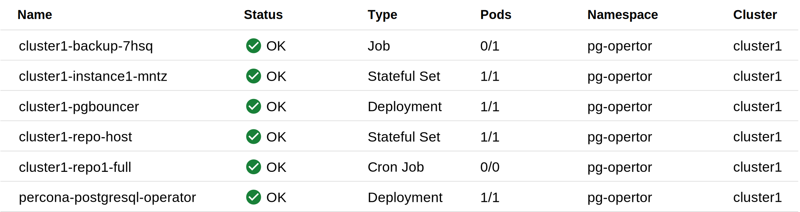

# Install Percona Distribution for PostgreSQL on Google Kubernetes Engine (GKE)

Following steps help you install the Operator and use it to manage
Percona Distribution for PostgreSQL with the Google Kubernetes Engine. The
document assumes some experience with Google Kubernetes Engine (GKE).
For more information on GKE, see the [Kubernetes Engine Quickstart](https://cloud.google.com/kubernetes-engine/docs/quickstart).

## Prerequisites

All commands from this installation guide can be run either in the **Google Cloud shell** or in **your local shell**.

To use *Google Cloud shell*, you need nothing but a modern web browser.

If you would like to use *your local shell*, install the following:


1. [gcloud](https://cloud.google.com/sdk/docs/quickstarts). This tool is part of the Google Cloud SDK. To install it, select your operating system on the [official Google Cloud SDK documentation page](https://cloud.google.com/sdk/docs) and then follow the instructions.

2. [kubectl](https://cloud.google.com/kubernetes-engine/docs/quickstart#choosing_a_shell). This is the Kubernetes command-line tool you will use to manage and deploy applications. To install the tool, run the following command:

    ``` {.bash data-prompt="$" }
    $ gcloud auth login
    $ gcloud components install kubectl
    ```

## Create and configure the GKE cluster

You can configure the settings using the `gcloud` tool. You can run it either in the [Cloud Shell](https://cloud.google.com/shell/docs/quickstart) or in your local shell (if you have installed Google Cloud SDK locally on the previous step). The following command creates a cluster named `cluster-1`:

``` {.bash data-prompt="$" }
$ gcloud container clusters create cluster-1 --project <project name> --zone us-central1-a --cluster-version {{ gkerecommended }} --machine-type n1-standard-4 --num-nodes=3
```

!!! note

    You must edit the above command and other command-line statements to
    replace the `<project name>` placeholder with your project name. You may
    also be required to edit the *zone location*, which is set to `us-central1`
    in the above example. Other parameters specify that we are creating a
    cluster with 3 nodes and with machine type of 4 vCPUs and 45 GB memory.

You may wait a few minutes for the cluster to be generated.

???+ note "When the process is over, you can see it listed in the Google Cloud console"

    Select *Kubernetes Engine* → *Clusters* in the left menu panel:

    

Now you should configure the command-line access to your newly created cluster
to make `kubectl` be able to use it.

In the Google Cloud Console, select your cluster and then click the *Connect*
shown on the above image. You will see the connect statement which configures
the command-line access. After you have edited the statement, you may run the
command in your local shell:

``` {.bash data-prompt="$" }
$ gcloud container clusters get-credentials cluster-1 --zone us-central1-a --project <project name>
```
Finally, use your [Cloud Identity and Access Management (Cloud IAM)](https://cloud.google.com/iam)
to control access to the cluster. The following command will give you the
ability to create Roles and RoleBindings:

``` {.bash data-prompt="$" }
$ kubectl create clusterrolebinding cluster-admin-binding --clusterrole cluster-admin --user $(gcloud config get-value core/account)
```

??? example "Expected output"

    ``` {.text .no-copy}
    clusterrolebinding.rbac.authorization.k8s.io/cluster-admin-binding created
    ```

## Install the Operator and deploy your PostgreSQL cluster

1. First of all, use the following `git clone` command to download the correct branch of the percona-postgresql-operator repository:

    ``` {.bash data-prompt="$" }
    $ git clone -b v{{ release }} https://github.com/percona/percona-postgresql-operator
    $ cd percona-postgresql-operator
    ```

2. Create the Kubernetes namespace for your cluster if needed (for example,
   let's name it `postgres-operator`):

    ``` {.bash data-prompt="$" }
    $ kubectl create namespace postgres-operator
    ```

    ??? example "Expected output"

        ``` {.text .no-copy}
        namespace/postgres-operator was created
        ```

    !!! note

        To use different namespace, specify other name instead of
        `postgres-operator` in the above command, and modify the 
        `-n postgres-operator` parameter with it in the following steps.
        You can also omit this parameter completely to deploy everything in the
        `default` namespace.

3. Deploy the Operator [using](https://kubernetes.io/docs/reference/using-api/server-side-apply/)
    the following command:

    ``` {.bash data-prompt="$" }
    $ kubectl apply --server-side -f deploy/bundle.yaml -n postgres-operator
    ```

    ??? example "Expected output"

        ```{.text .no-copy}
        customresourcedefinition.apiextensions.k8s.io/perconapgbackups.pgv2.percona.com serverside-applied
        customresourcedefinition.apiextensions.k8s.io/perconapgclusters.pgv2.percona.com serverside-applied
        customresourcedefinition.apiextensions.k8s.io/perconapgrestores.pgv2.percona.com serverside-applied
        customresourcedefinition.apiextensions.k8s.io/postgresclusters.postgres-operator.crunchydata.com serverside-applied
        serviceaccount/percona-postgresql-operator serverside-applied
        role.rbac.authorization.k8s.io/percona-postgresql-operator serverside-applied
        rolebinding.rbac.authorization.k8s.io/service-account-percona-postgresql-operator serverside-applied
        deployment.apps/percona-postgresql-operator serverside-applied
        ```

    As the result you will have the Operator Pod up and running.

4. Deploy Percona Distribution for PostgreSQL:

    ``` {.bash data-prompt="$" }
    $ kubectl apply -f deploy/cr.yaml -n postgres-operator
    ```

    ??? example "Expected output"

        ```{.text .no-copy}
        perconapgcluster.pgv2.percona.com/cluster1 created
        ```

    Creation process will take some time. The process is over when both
    Operator and PostgreSQL Pods have reached their Running status:

    ``` {.bash data-prompt="$" }
    $ kubectl get pg -n postgres-operator
    ```

    ??? example "Expected output"

        ```{.text .no-copy}
        NAME       ENDPOINT                                   STATUS   POSTGRES   PGBOUNCER   AGE
        cluster1   cluster1-pgbouncer.postgres-operator.svc   ready    3          3           143m
        ```

    ??? note "You can also track the creation process in Google Cloud console via the Object Browser"

        When the creation process is finished, it will look as follows:

        

## Verifying the cluster operation

When creation process is over, `kubectl get pg -n <namespace>` command will show you the
cluster status as `ready`, and you can try to connect to the cluster.



## Removing the cluster

If you need to delete the Operator and PostgreSQL cluster (for example, to clean
up the testing deployment before adopting it for production use), check
[this HowTo](delete.md).

Also, there are several ways that you can delete your Kubernetes cluster in GKE.

You can clean up the cluster with the `gcloud` command as follows:

``` {.bash data-prompt="$" }
$ gcloud container clusters delete <cluster name>
```

The return statement requests your confirmation of the deletion. Type `y` to confirm.

??? note "Also, you can delete your cluster via the Google Cloud console"

    Just click the `Delete` popup menu item in the clusters list:

    

The cluster deletion may take time.

!!! warning

    After deleting the cluster, all data stored in it will be lost!
