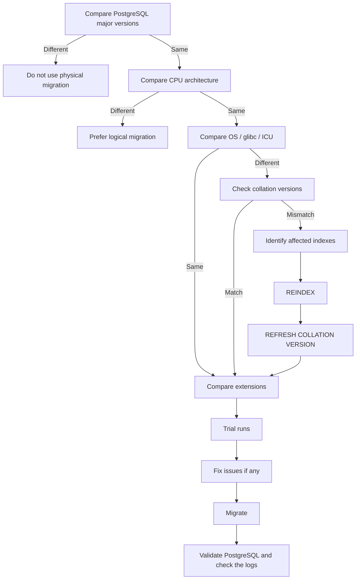

# Pre-migration compatibility checks

!!! important

    Read this before you migrate.
    
Complete these checks **before** you pick a migration method. Verify that source and target environments are compatible. For physical migration methods such as pgBackRest restore, standby replication, or reusing the existing
PostgreSQL data volume, CPU architecture and the PostgreSQL major version must match. If they don't, use a logical method such as `pg_dump` / `pg_restore` instead.

Differences in the operating system, libraries like `glibc`, ICU, or PostgreSQL extensions do not always block a physical move, but they do require additional actions before or after the migration.

## Decide whether a physical method is safe

Use this flow to interpret the checks. Then gather the facts in the sections that follow.



## Compare PostgreSQL major versions

The PostgreSQL major version of the source and target database images must match when you use a physical method.

Check the source (Crunchy) PostgreSQL version:

```bash
kubectl exec -n <namespace> <source-postgres-pod> -c database -- \
  postgres --version
```

??? example "Sample output"

    ```text
    postgres (PostgreSQL) 18.6
    ```

Check the version in the target Percona image as well. Find tags in [Percona certified images](images.md). If the Percona cluster is not running yet, start a temporary Pod from the target image:

```bash
kubectl run pg-image-check --rm -it --restart=Never \
  --image=<percona-postgres-image> -- \
  postgres --version
```

The major versions must match, for example:

```text
Source: postgres (PostgreSQL) 18.6
Target: postgres (PostgreSQL) 18.6 - Percona Server for PostgreSQL 18.6.1
```

A difference in the minor version is normally supported by PostgreSQL's physical storage format, but the target minor version should be equal to or newer than the source.

Do not reuse `PGDATA` or restore a physical backup directly into a different PostgreSQL major version.

## Compare CPU architecture

Check the architecture of both the source and target PostgreSQL containers:

```bash
kubectl exec -n <namespace> <source-postgres-pod> -c database -- uname -m
kubectl exec -n <namespace> <percona-postgres-pod> -c database -- uname -m
```

??? example "Expected output"

    ```text
    x86_64
    ```

    or:

    ```text
    aarch64
    ```

The source and target should use the same architecture when you use a physical method.

For example:

```text
x86_64 -> x86_64    OK
ARM64  -> ARM64     OK
x86_64 -> ARM64     Do not use a physical migration
```

Use a logical method, such as `pg_dump` / `pg_restore`, when you migrate across incompatible architectures.

## Compare OS, glibc, and ICU

Run these commands against the source Crunchy pod. Repeat them against the target Percona image (use a temporary Pod if the cluster is not running yet).

### Check operating system 

--8<-- "check-os-glibc.txt"

--8<-- "glibc-versions.txt"

If the Crunchy image is UBI 8 and you use the default Percona image (UBI 9), you will see a `glibc` change:

```text
Source:
  UBI 8
  glibc 2.28

Target:
  UBI 9
  glibc 2.34
```

A different `glibc` version does not by itself make the PostgreSQL data directory incompatible. `glibc` provides locale and collation rules that PostgreSQL uses. A change in these rules can make existing collation-dependent indexes inconsistent with the target operating system. See [Locale data changes](https://wiki.postgresql.org/wiki/Locale_data_changes) in the PostgreSQL wiki.

### Check ICU library version

PostgreSQL may also use ICU for collations. Check the locale provider in each database:

```sql
  SELECT datname, datlocprovider, datcollversion FROM pg_database;
```

??? example "Sample output"
    
    ```text
      datname  | datlocprovider | datcollversion
    -----------+----------------+----------------
    postgres  | c              | 2.34
    template1 | c              | 2.34
    template0 | c              |
    cluster1  | c              | 2.34
    (4 rows)
    ```

`c` is libc (`glibc`). `i` is ICU. If the provider is `i` and the source and target images ship different ICU libraries, treat that the same as a `glibc` change.

If `glibc` or ICU differs, run the collation checks **after** PostgreSQL starts on the target image. You can run the index scan on the source cluster beforehand to estimate the work.

[Connect to PostgreSQL](connect.md) with the privileges of the superuser or the database owner and run the following query:

```sql
SELECT DISTINCT
    indrelid::regclass::text,
    indexrelid::regclass::text,
    collname,
    pg_get_indexdef(indexrelid)
FROM (
    SELECT
        indexrelid,
        indrelid,
        indcollation[i] coll
    FROM
        pg_index,
        generate_subscripts(indcollation, 1) g(i)
) s
JOIN pg_collation c ON coll = c.oid
WHERE
    collprovider IN ('d', 'c')
    AND collname NOT IN ('C', 'POSIX');
```

Check indexes that rely on collations other than `C` or `POSIX` and whose collations were provided by the operating system (`c`) or dynamic libraries (`d`). If you see affected indexes, find the databases whose collation
version changed:

```sql
SELECT datname, datlocprovider, datcollate, datcollversion
FROM pg_database;
```

??? example "Sample output"

    ```{.text .no-copy}
    datname   | datlocprovider | datcollate  | datcollversion
    ----------+----------------+-------------+----------------
    postgres  | c              | en_US.utf-8 | 2.28
    template1 | c              | en_US.utf-8 | 2.28
    template0 | c              | en_US.utf-8 |
    cluster1  | c              | en_US.utf-8 | 2.28
    ```


## Compare extensions

Record the extension list and versions on the source cluster before you migrate.

--8<-- "pg-extensions-list.txt"

Verify that each extension is available in the target Percona image. Percona Distribution for PostgreSQL ships a defined set of tested extensions. Their versions may differ from the Crunchy image. 

You can also [add custom extensions](custom-extensions.md#add-custom-extensions) if you need them. Evaluate the risk before you add any extension.

Pay particular attention to extensions that contain native C/C++ libraries. Those extensions need a shared library in the PostgreSQL installation, not only a catalog entry in `PGDATA`. Do not assume an extension is available because it exists in `pg_extension`.

## Before you cut over

Perform at least **three successful trial runs** in a comparable test environment and run application validation tests. Prepare detailed, environment-specific runbooks before you migrate production workloads.

After PostgreSQL starts under Percona Operator for PostgreSQL, check the PostgreSQL logs for errors, then confirm that collation rebuilds and extensions are complete.
