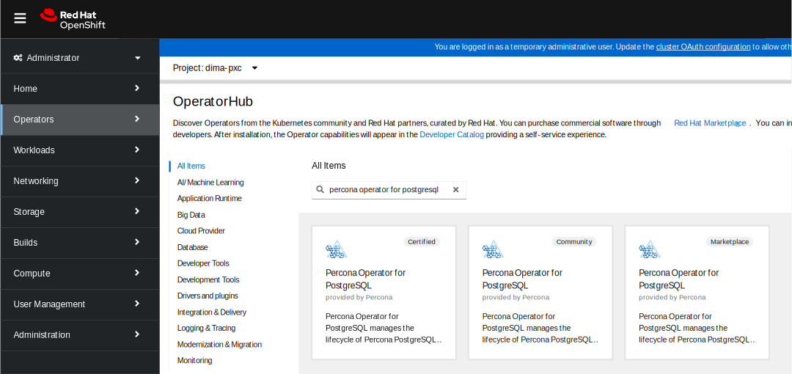
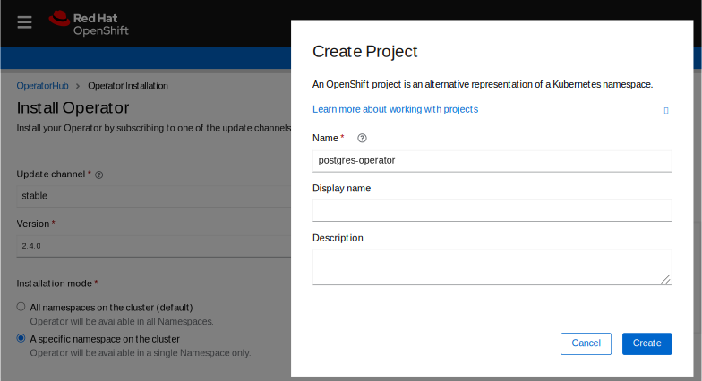
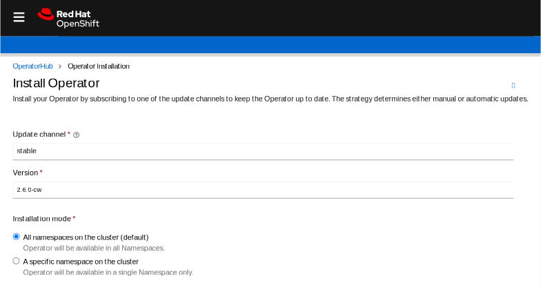
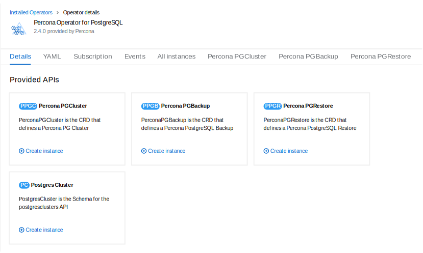

# Install Percona Distribution for PostgreSQL on OpenShift



Percona Operator for PostgreSQL is a [Red Hat Certified Operator :octicons-link-external-16:](https://connect.redhat.com/en/partner-with-us/red-hat-openshift-certification). This means that Percona Operator is portable across hybrid clouds and fully supports the Red Hat OpenShift lifecycle.

Installing Percona Distribution for PostgreSQL on OpenShift includes two steps:

* Installing the Percona Operator for PostgreSQL,
* Install Percona Distribution for PostgreSQL using the Operator.

## Install the Operator

You can install Percona Operator for MySQL on OpenShift using the web interface (the [Operator Lifecycle Manager :octicons-link-external-16:](https://docs.redhat.com/en/documentation/openshift_container_platform/4.2/html/operators/understanding-the-operator-lifecycle-manager-olm#olm-overview_olm-understanding-olm) or [Red Hat Marketplace :octicons-link-external-16:](https://marketplace.redhat.com), or using the command line interface.

### Install the Operator via the Operator Lifecycle Manager (OLM)

Operator Lifecycle Manager (OLM) is a part of the [Operator Framework :octicons-link-external-16:](https://github.com/operator-framework) that allows you to install, update, and manage the Operators lifecycle on the OpenShift platform.

Following steps will allow you to deploy the Operator and PostgreSQL cluster on your OLM installation:

1. Login to the OLM and click the needed Operator on the OperatorHub page:

    

    Then click "Contiune", and "Install".

2. A new page will allow you to choose the Operator version and the Namespace / OpenShift project you would like to install the Operator into.

    

    !!! note

        If you are going to install the Operator in [multi-namespace (cluster-wide) mode](cluster-wide.md), please choose values with `-cw` suffix for the update channel and version, and select the "All namespaces on the cluster" radio button for the installation mode instead of chosing a specific Namespace:

        

    Click "Install" button to actually install the Operator.

3. When the installation finishes, you can deploy PostgreSQL cluster. In the "Operator Details" you will see Provided APIs (Custom Resources, available for installation). Click "Create instance" for the `PerconaPGCluster` Custom Resource.

    

    You will be able to edit manifest to set needed Custom Resource options, and then click "Create" button to deploy your database cluster.

### Install the Operator via the command-line interface

1. First of all, clone the percona-postgresql-operator repository:

    ``` {.bash data-prompt="$" }
    $ git clone -b v{{ release }} https://github.com/percona/percona-postgresql-operator
    $ cd percona-postgresql-operator
    ```

    !!! note

        It is crucial to specify the right branch with `-b` option while cloning the
        code on this step. Please be careful.

2. The Custom Resource Definition for Percona Distribution for PostgreSQL should
    be created from the `deploy/crd.yaml` file. Custom Resource Definition
    extends the standard set of resources which OpenShift “knows” about with
    the new items (in our case ones which are the core of the Operator).
    [Apply it :octicons-link-external-16:](https://kubernetes.io/docs/reference/using-api/server-side-apply/)
    as follows:

    ``` {.bash data-prompt="$" }
    $ oc apply --server-side -f deploy/crd.yaml
    ```

    This step should be done only once; it does not need to be repeated with any
    other Operator deployments.

3. Create the OpenShift namespace for your cluster if needed (for example,
    let's name it `postgres-operator`):

    ``` {.bash data-prompt="$" }
    $ oc create namespace postgres-operator
    ```

    !!! note

        To use different namespace, specify other name instead of
        `postgres-operator` in the above command, and modify the 
        `-n postgres-operator` parameter with it in the following two steps.
        You can also omit this parameter completely to deploy everything in the
        `default` namespace.

4. The role-based access control (RBAC) for Percona Distribution for PostgreSQL
    is configured with the `deploy/rbac.yaml` file. Role-based access is based
    on defined roles and the available actions which correspond to each role.
    The role and actions are defined for Kubernetes resources in the yaml file.
    Further details about users and roles can be found in specific [OpenShift documentation :octicons-link-external-16:](https://docs.openshift.com/enterprise/3.0/architecture/additional_concepts/authorization.html))

    ``` {.bash data-prompt="$" }
    $ oc apply -f deploy/rbac.yaml -n postgres-operator
    ```

    !!! note

        Setting RBAC requires your user to have cluster-admin role
        privileges. For example, those using Google OpenShift Engine can
        grant user needed privileges with the following command:

        ```default
        $ oc create clusterrolebinding cluster-admin-binding --clusterrole=cluster-admin --user=$(gcloud config get-value core/account)
        ```

5. If you are going to use the operator with [anyuid :octicons-link-external-16:](https://docs.openshift.com/container-platform/4.9/authentication/managing-security-context-constraints.html) security context constraint
    please execute the following command:

    ``` {.bash data-prompt="$" }
    $ sed -i '/disable_auto_failover: "false"/a \ \ \ \ disable_fsgroup: "false"' deploy/operator.yaml
    ```

6. Start the Operator within OpenShift:

    ``` {.bash data-prompt="$" }
    $ oc apply -f deploy/operator.yaml -n postgres-operator
    ```

    Optionally, you can add PostgreSQL Users secrets and TLS certificates to
    OpenShift. If you don't, the Operator will create the needed users and
    certificates automatically, when you create the database cluster. You can
    see documentation on [Users](users.md) and [TLS certificates](TLS.md) if
    still want to create them yourself.

    !!! note

        You can simplify the Operator installation by applying a single
        `deploy/bundle.yaml` file instead of running commands from the steps
        2 and 4:
        
        ``` {.bash data-prompt="$" }
        $ oc apply -f deploy/bundle.yaml
        ```
        
        This will automatically create Custom Resource Definition, set up
        role-based access control and install the Operator as one single action.

7. After the Operator is started Percona Distribution for PostgreSQL cluster can
    be created at any time with the following command:

    ``` {.bash data-prompt="$" }
    $ oc apply -f deploy/cr.yaml -n postgres-operator
    ```

    Creation process will take some time. The process is over when both
    Operator and replica set Pods have reached their Running status:

    ``` {.bash data-prompt="$" }
    $ oc get pg -n postgres-operator
    ```

    ??? example "Expected output"

        ```{.text .no-copy}
        NAME       ENDPOINT                                   STATUS   POSTGRES   PGBOUNCER   AGE
        cluster1   cluster1-pgbouncer.postgres-operator.svc   ready    3          3           143m
        ```

## Verifying the cluster operation

When creation process is over, `oc get pg` command will show you the
cluster status as `ready`, and you can try to connect to the cluster.


