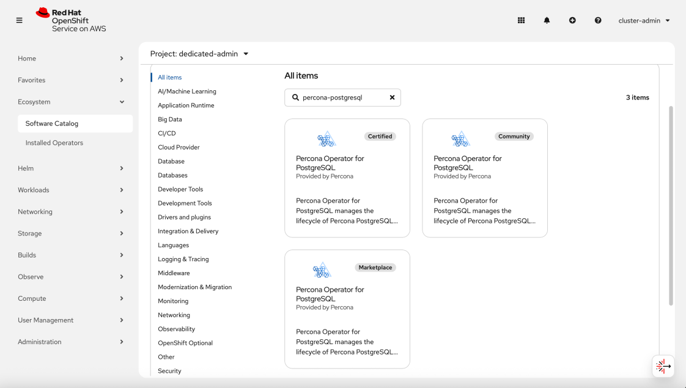
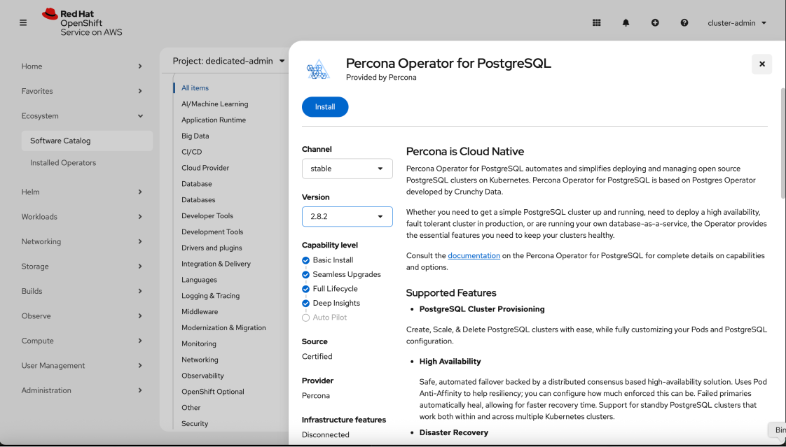
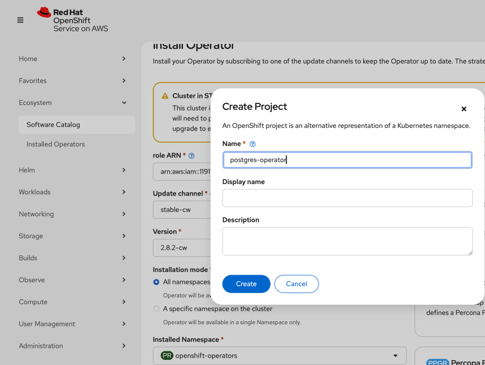
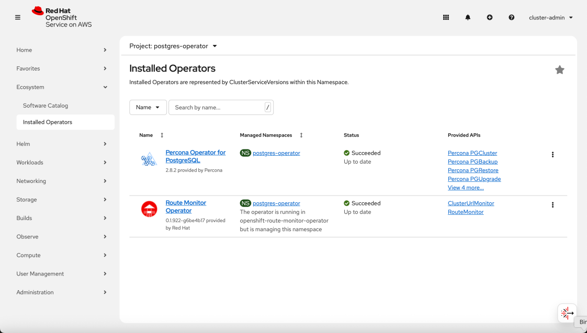
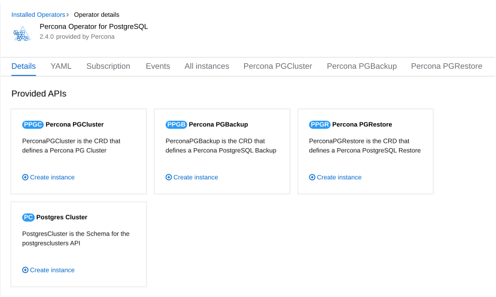

# Install Percona Distribution for PostgreSQL on OpenShift



Percona Operator for PostgreSQL is a [Red Hat Certified Operator :octicons-link-external-16:](https://connect.redhat.com/en/partner-with-us/red-hat-openshift-certification). This means that Percona Operator is portable across hybrid clouds and fully supports the Red Hat OpenShift lifecycle.

To install Percona Distribution for PostgreSQL on OpenShift, you need to do the following:

1. First, install the Percona Operator for PostgreSQL Deployment. 
2. Next, use the Operator to create Percona Distribution for PostgreSQL cluster.

## Installation options

You can install Percona Operator for PostgreSQL on OpenShift in two ways:

- **Using the [Operator Lifecycle Manager (OLM) :octicons-link-external-16:](https://docs.redhat.com/en/documentation/openshift_container_platform/4.21/html/operators/understanding-operators#operator-lifecycle-manager-olm)** via the OpenShift web console
- **Using the command-line interface** with `oc` commands

Choose the method that best fits your workflow.

## Install via the Operator Lifecycle Manager (OLM)

Operator Lifecycle Manager (OLM) is a part of the [Operator Framework :octicons-link-external-16:](https://github.com/operator-framework) that allows you to install, update, and manage the Operators lifecycle on the OpenShift platform.

### Prerequisites

Before you start, ensure you have the following:

1. You can log in to the OLM console
2. You have the ARN role assigned to your OLM user.

### Install the Operator Deployment 

Follow these steps to deploy the Operator and Percona Distribution for PostgreSQL cluster:

1. Login to the OLM and navigate to the Software Catalog.
2. Search for the needed Operator and select it. You may need to change the project for your user:

    

    Then click "Continue", and "Install".

3. A new page opens where you specify the ARN role assigned to your user. You also choose the Operator version and the Namespace / OpenShift project you would like to install the Operator into.

    

    !!! note

        To install the Operator in [multi-namespace (cluster-wide) mode](cluster-wide.md), choose the value with the `-cw` suffix for the version, and select the "All namespaces on the cluster" radio button for the installation mode instead of choosing a specific Namespace:

        

    Click "Install" button to install the Operator.

4. You can track the installation flow by clicking the link on the updated page. You will be redirected to the Installed Operators tab. Your installed Operator will appear there. 

    

### Deploy Percona Distribution for PostgreSQL

When the installation finishes, you can deploy PostgreSQL cluster. 

1. In the "Operator Details" you will see Provided APIs (Custom Resources, available for installation). Click "Create instance" for the `PerconaPGCluster` Custom Resource.

    

2. You can either go with default settings or edit them as needed. You can use the form or edit the YAML manifest to set needed Custom Resource options.
3. Click the "Create" button to deploy your database cluster.

## Install via the command-line interface

The following steps install the latest version of the Operator with default parameters. To install a specific version, replace the `v{{ release }}` tag with your value. See the full list of tags [in the Operator repository :octicons-link-external-16:](https://github.com/percona/percona-postgresql-operator/tags) on GitHub.

To install the Operator with customized parameters, see [Install Percona Operator for PostgreSQL with customized parameters](custom-install.md).

Choose the approach that fits your needs:

* **Quick install** — Apply a single bundle file. Use this when you want to get started quickly with default settings.
* **Step-by-step install** — Run each installation step separately. Use this when
  you need to customize the installation (for example, apply the [anyuid :octicons-link-external-16:](https://docs.openshift.com/container-platform/4.21/authentication/managing-security-context-constraints.html)
  security context constraint).

=== ":material-rocket-launch: Quick install"

    The bundle file creates the Custom Resource Definition, sets up RBAC, and installs the Operator Deployment in one go. 

    1. Create the namespace for your cluster:

        ```bash
        oc create namespace postgres-operator
        ```

    2. Export the namespace as an environment variable:
        
        ```bash
        export NAMESPACE=postgres-operator
        ```

    3. Apply the bundle to install the Operator:

        ```bash
        oc apply --server-side -f https://raw.githubusercontent.com/percona/percona-postgresql-operator/v{{ release }}/deploy/bundle.yaml -n $NAMESPACE
        ```

=== ":material-format-list-numbered: Step-by-step install"

    Install the Operator step by step if you wish to have more control over the installation process and modify the manifests before you apply them.

    1. Clone the percona-postgresql-operator repository:

        ```bash
        git clone -b v{{ release }} https://github.com/percona/percona-postgresql-operator
        cd percona-postgresql-operator
        ```
    2. Create the Custom Resource Definition (CRD). CRDs are cluster-scoped and apply to all namespaces. You don't need to repeat this step for additional Operator deployments:

        ```bash
        oc apply --server-side -f deploy/crd.yaml
        ```

    3. Create the namespace for your cluster (for example, `postgres-operator`):

        ```bash
        oc create namespace postgres-operator
        ```

    4. Export the namespace as an environment variable:
        
        ```bash
        export NAMESPACE=postgres-operator
        ```

    5. Apply RBAC configuration. Your user must have cluster-admin privileges:

        ```bash
        oc apply -f deploy/rbac.yaml -n $NAMESPACE
        ```

        !!! note

            For example, if you use Google OpenShift Engine, grant cluster-admin
            privileges with:

            ```bash
            oc create clusterrolebinding cluster-admin-binding --clusterrole=cluster-admin --user=$(gcloud config get-value core/account)
            ```

    6. If you use the [anyuid :octicons-link-external-16:](https://docs.openshift.com/container-platform/4.21/authentication/managing-security-context-constraints.html)
    security context constraint, modify the Operator manifest before applying:

        ```bash
        sed -i '/disable_auto_failover: "false"/a \ \ \ \ disable_fsgroup: "false"' deploy/operator.yaml
        ```

    7. Create the Operator Deployment:

        ```bash
        oc apply -f deploy/operator.yaml -n $NAMESPACE
        ```

### Install Percona Distribution for PostgreSQL cluster

1. Create the Percona Distribution for PostgreSQL cluster:

    ```bash
    oc apply -f deploy/cr.yaml -n $NAMESPACE
    ```

2. Check the cluster status. Creation may take a few minutes:

    ```bash
    oc get pg -n $NAMESPACE
    ```

    ??? example "Expected output"

        ```{.text .no-copy}
        NAME       ENDPOINT                                   STATUS  POSTGRES   PGBOUNCER   AGE
        cluster1   cluster1-pgbouncer.postgres-operator.svc   ready   3          3           143m
        ```

Optionally, you can add PostgreSQL Users secrets and TLS certificates before creating the cluster. If you don't, the Operator creates them automatically. See [Users](users.md) and [TLS certificates](TLS.md) for details.

## Verifying the cluster operation

When creation process is over, `oc get pg` command will show you the
cluster status as `ready`, and you can try to connect to the cluster.


