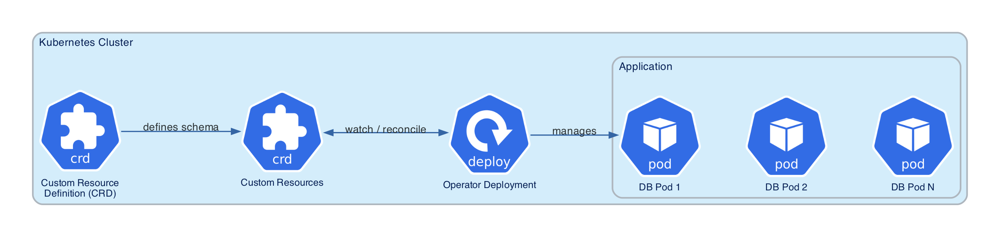

# Kubernetes Operator concepts

If you already run workloads on Kubernetes, you are used to declaring *desired state* in YAML and letting controllers create Pods, Services, and other objects. A **Kubernetes Operator** applies the same idea to a whole application stack—such as a database cluster—so you do not have to assemble every low-level object by hand.

This page explains what Operators are in general and how **Percona Operator for PostgreSQL** fits in that model. For how reconciliation and Custom Resources work in practice, see [How the Operator works](operator-how-it-works.md). To learn more what the Operator manages, see [Architecture](architecture.md). 

## What is a Kubernetes Operator?

An Operator is a way to **package, deploy, and manage** a complex application like databases on Kubernetes. It extends the Kubernetes API with custom resources so you can create and update instances of that application using the same `kubectl` and GitOps workflows you use elsewhere.

At its core, an Operator is a **custom controller**. It watches [custom resources](#custom-resources-explained), compares what *should* exist (desired state) with what *does* exist (current state), and takes steps to bring them in line. That pattern is often called a **control loop** or **reconciliation loop**.

**Percona Operator for PostgreSQL** was originally built upon patterns and components from [CrunchyData’s PostgreSQL Operator :octicons-link-external-16:](https://access.crunchydata.com/documentation/postgres-operator/v5/), benefiting from industry best practices for PostgreSQL management on Kubernetes. Since version 3.0.0, Percona Operator for PostgreSQL has evolved into an independent software solution, continuing to develop the Operator as open source software alongside the database and tooling stack. The Operator leverages Percona’s expertise in PostgreSQL management, delivering a solution that addresses the unique challenges of cloud-native database operations and lifecycle management.

Percona Operator for PostgreSQL PostgreSQL lifecycle management by automating tasks such as initialization, scaling, backups, updates, and disaster recovery.

## Custom Resources explained

How Percona Operator for PostgreSQL works in Kubernetes is defined by the relationship between these core components:

* Custom Resource Definition
* Custom Resource 
* Operator Deployment

### Custom Resource Definition (CRD)

A **Custom Resource Definition** is a schema that defines a new type of resource in Kubernetes. It tells Kubernetes:

- What fields the custom resource will have
- What types of values those fields can contain
- How the resource should be validated

For example, a Custom Resource Definition for a database cluster called `PostgreSQLCluster` has fields like `replicas`, `storageSize`, `postgresVersion`, etc.

### Custom Resource (CR)

A **Custom Resource** is an instance of a CRD. It represents a specific deployment of your application. When you create a Custom Resource, you're essentially declaring your desired state for that application.

For instance, you might create a Custom Resource named `my-postgres-cluster` that specifies that you want a PostgreSQL cluster with 3 replicas, 100GB of storage, and PostgreSQL version 18.

### Operator Deployment

The **Operator** itself is deployed as a standard Kubernetes Deployment. It runs as a Pod (or set of Pods) in your cluster and contains the controller logic that:

1. Watches for Custom Resources of the type defined by the CRD
2. Reads the desired state from the Custom Resource
3. Compares it with the current state of the cluster
4. Takes actions to reconcile any differences - to bring the current cluster state to the desired state defined in the Custom Resource

In short: the CRD extends the API with the new resources and defines the *shape* of the resource, the CR is *your* declaration of the resource, and the Operator is the automation that *implements* it.

The following is the components workflow:  

1. **Install CRDs** — The new API kinds appear in the cluster.

2. **Install Operator Deployment**: The Operator Pod is deployed, and it starts watching for resources.

3. **Create Custom Resource**: You create and apply a Custom Resource YAML file that describes your desired cluster state

4. **Reconcile**: The Operator detects the new Custom Resource, reads its specification, and creates the necessary Kubernetes resources (StatefulSets, Services, ConfigMaps, Secrets, etc.) to bring the application (PostgreSQL in our case) into existence.

5. **Monitor continuously**: The Operator continuously monitors both the Custom Resource and the actual cluster state, making adjustments whenever they diverge.

## Why use an Operator for a database?

The Operator is a game-changer for database management on Kubernetes: it frees administrators and infrastructure teams from tedious, error-prone operational work, allowing them to focus on more important and interesting tasks rather than manual maintenance.

Traditionally, deploying PostgreSQL in Kubernetes means you must create, wire together, and continuously maintain many objects like StatefulSets, Services, PVCs, ConfigMaps, Secrets, backup Jobs, monitoring hooks, and more. Every change or upgrade requires manual intervention and careful coordination.

With an Operator, all you do is describe your desired cluster in a Custom Resource. The Operator reads it and does the works for you:

* It automatically translates your intent into concrete, production-ready objects
* Integrates trusted open source tools like Patroni for high availability pgBackRest for backup/restore operations, and pgBouncer for connection pooling
* Keeps your cluster healthy and up to date, even as requirements change

Day-to-day, the Operator automates the most challenging and repetitive database tasks: seamless failovers, backup management, rolling upgrades, scaling, and self-healing. 

By trusting the Operator to manage your database infrastructure, your team can focus on building features and improving your applications rather than deal with unexpected outages. 

## Next steps

[Features and capabilities](features.md){.md-button}
