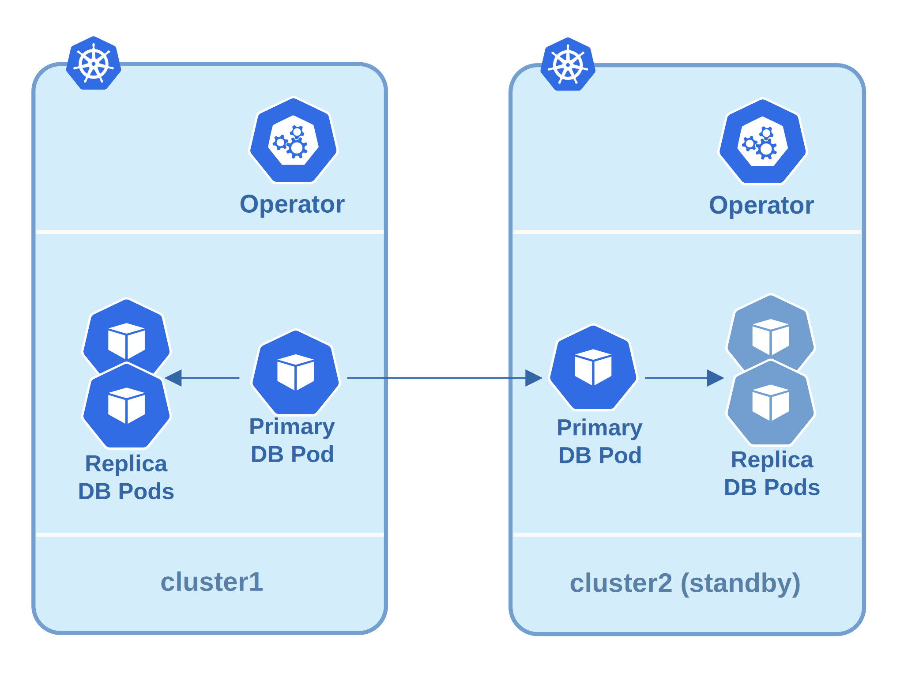

# Standby cluster deployment based on streaming replication

The pgBackRest repo-based standby is the simplest one. The following is the architecture diagram:



## pgBackrest repo based standby

1. This solution describes two Kubernetes clusters in different regions, clouds, data centers or even two namespaces, or running in hybrid mode (on-premises and cloud). One cluster is Main site, and the other is Disaster Recovery site (DR)

2. Each site supposedly includes Percona Operator and for sure includes PostgreSQL cluster.

3. In the DR site the cluster is in Standby mode

4. We set up streaming replication between these two clusters

## Deploy disaster recovery for PostgreSQL on Kubernetes

### Configure Main site

1. Deploy the Operator [using your favorite method](System-Requirements.md#installation-guidelines).

2. The Main cluster needs to expose it, so that standby can connect to the primary PostgreSQL instance. To expose the primary PostgreSQL instance, use the `spec.expose` section:

    ```yaml
    spec:
      ...
      expose:
        type: ClusterIP
    ```

    Use here a Service type of your choice. For example, `ClusterIP` is sufficient for two clusters in different Kubernetes namespaces.

3. Once configured, apply the custom resource:

    ```{.bash data-prompt="$"}
    $ kubectl apply -f deploy/cr.yaml -n main-pg
    ```

    ??? example "Expected output"

        ```{.bash .no-copy}
        perconapgcluster.pg.percona.com/standby created
        ```

    The service that you should use for connecting to standby is called <clustername>-ha (main-ha in my case):

    ```text
    main-ha          ClusterIP   10.118.227.214   <none>        5432/TCP   163m
    ```

### Configure DR site

To get the replication working, the Standby cluster would need to authenticate with the Main one. To get there, both clusters must have certificates signed by the same certificate authority (CA). Default replication user `_crunchyrepl` will be used.

In the simplest case you can copy the certificates from the Main cluster. You need to look out for two files:
* main-cluster-cert
* main-replication-cert 

Copy them to the namespace where DR cluster is going to be running and reference under `spec.secrets` (in the following example they were renamed, replacing "main" with "dr"):

```yaml
spec:
  secrets:
    customTLSSecret:
      name: dr-cluster-cert
    customReplicationTLSSecret:
      name: dr-replication-cert
```

If you are generating your own certificates, just remember the following rules:

1. Certificates for both Main and Standby clusters must be signed by the same CA
2. `customReplicationTLSSecret` must have a Common Name (CN) setting that matches `_crunchyrepl`, which is a default replication user.

You can find more about certificates in the [TLS doc](TLS.md).

Apart from setting certificates correctly, you should also set standby configuration.

```yaml
  standby:
    enabled: true
    host: main-ha.main-pg.svc
```

* `standby.enabled` controls if it is a standby cluster or not
* `standby.host` must point to the primary node of a Main cluster. In this example it is a `main-ha` Service in another namespace.

Deploy the standby cluster by applying the manifest:

```{.bash data-prompt="$"}
$ kubectl apply -f dr-cr.yaml -n dr-pg
```

??? example "Expected output"

    ```{.bash .no-copy}
    perconapgcluster.pg.percona.com/standby created
    ```

Once both clusters are up, you can verify that replication is working.

1. Insert some data into Main cluster
2. Connect to the DR cluster

To connect to the DR cluster, use the credentials that you used to connect to Main. This also verifies that the connection is working. You should see whatever data you have in the Main cluster in the Disaster Recovery.


