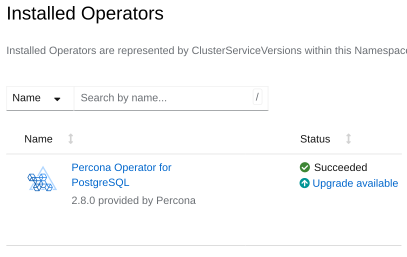

# Upgrade the Operator and the database on OpenShift

The upgrade on OpenShift consists of two steps:

* Upgrade the Operator Deployment
* Upgrade the database cluster

## Upgrade the Operator via Operator Lifecycle Manager (OLM)

You can upgrade the Operator Deployment for PostgreSQL that was [installed on the OpenShift platform using OLM](openshift.md#install-via-the-operator-lifecycle-manager-olm) directly through the Operator Lifecycle Manager. 

If you know the OLM upgrade workflow, jump to the [Operator Deployment upgrade steps](#before-you-start).

### Understand how OLM applies Operator upgrades

OLM manages the Operator using a resource called a `ClusterServiceVersion` (CSV).
Each CSV represents a specific version of the Operator and contains:

* the Operator Deployment specification
* required RBAC permissions
* CRD definitions
* metadata and examples

When a new Operator version is available and the upgrade is approved, OLM installs the new CSV and reconciles the Operator Deployment to match it.
The following items are replaced with the values defined in the new CSV:

* container image
* command and arguments
* labels and annotations
* probes
* most Deployment fields

If you previously customized the Operator Deployment manually, these changes are overwritten during the upgrade.

The CRD may be updated too, if the new Operator version introduces schema changes.
However, OLM doesn't modify the `PerconaPGCluster` Custom Resource. It remains unchanged and continues running with its current configuration. For how to update it, refer to [Upgrade Percona Distribution for PostgreSQL](#upgrade-percona-distribution-for-postgresql).

#### Persisting custom Operator configuration

If you need to customize the Operator Deployment (for example, to adjust resource limits or set environment variables), you can do it through the Subscription.

A Subscription is the OLM resource that defines which operator you want to install and how you want it to be upgraded. A Subscription connects your cluster to an Operator package in a CatalogSource and ensures that OLM continuously manages that Operator according to your chosen update strategy.

Here's how you can customize the Operator Deployment. This example command sets an environment variable for the Operator:

```bash
kubectl patch subscription percona-postgresql-operator -n <namespace> \
  --type merge \
  -p '{"spec":{"config":{"env":[{"name":"LOG_LEVEL","value":"DEBUG"}]}}}'
```

OLM supports overriding only the following fields through the Subscription:

* env
* envFrom
* volumes
* volumeMounts
* resources
* nodeSelector
* tolerations
* affinity

These overrides are applied on top of the CSV and persist across upgrades. All other fields are overridden by the values from the new CSV during the Operator Deployment upgrade.

### Before you start

Before you upgrade the Operator deployment, prepare your environment depending on what catalogue you used to install it from:

* For **Community catalogues**, verify whether the Operator runs in single-namespace or all-namespaces mode and which namespace it targets. That helps you avoid reconciliation conflicts.
* For **Certified container images** (Red Hat / OperatorHub), the `stable` installation channel supports both single- and all-namespace modes starting with version 3.0.0. The `stable-cw` channel is therefore deprecated. As the pre-upgrade steps, you must do the following:
  
    * Update the Subscription to the `stable` channel (recommended)
    * Confirm how the Operator watches namespaces 
    * Align `initContainer.image` on each PostgreSQL cluster Custom Resource. Without updating `initContainer.image`, clusters may enter an error state after the Operator upgrade.

=== "Community catalogues"

    1. Verify the installation mode and target namespace

        === "OpenShift web console"

            Open the YAML manifest for the Operator installation. Verify the target namespace settings for the `targetNamespaces` option. 

        === "Command line"

            ```bash
            oc get operatorgroup -n <operator-namespace> -o yaml
            ```
   
        Interpret the output:

        * A **single-namespace** install usually defines target namespaces explicitly:

           ```yaml
           spec:
             targetNamespaces:
               - <target-namespace>
           ```

        * An **all-namespaces** install has no `spec.targetNamespaces` configured:

           ```yaml
           spec: {}
           ```

    2. In **all-namespaces** mode, the Operator watches all namespaces on the cluster. If Percona PostgreSQL custom resources already exist outside the operator’s installation namespace, the operator may start managing them after the upgrade. This may happen if you deployed several Operators in the same OpenShift cluster, all in the all namespace mode. 
        
        To avoid conflicts during reconciliation, repeat step 1 for **every** Operator you deployed. If more than one Operator is installed in all-namespaces mode, adjust the `spec.targetNamespaces` value for each OperatorGroup to the namespace this Operator must manage.

=== "Certified container catalogues"

    1. Update the `initContainer` image on each cluster

        You must manually set `spec.initContainer.image` on each `PerconaPGCluster` (`pg`) Custom Resource that this Operator manages. Without this, clusters may enter an error state after the Operator upgrade.

        1. Export namespaces you use for commands (use your Operator namespace and the namespace where each cluster CR lives; they may differ in multi-namespace setups):

            ```bash
            export OPERATOR_NAMESPACE=postgres-operator
            export CLUSTER_NAMESPACE=postgres-operator
            ```

        2. Retrieve the current Operator image to reuse for `initContainer.image`:

            ```bash
            oc get deploy percona-postgresql-operator -n "$OPERATOR_NAMESPACE" \
              -o jsonpath='{.spec.template.spec.containers[*].image}'
            ```

            Find the `image` value in the output, for example:

            ```yaml
            registry.connect.redhat.com/percona/percona-postgresql-operator@sha256:986941a8c5f5d00a0c9cc7bd12acc9f78aa51fdcc98c7d0acddff05392d4b9a0
            ```

        3. Patch each PostgreSQL cluster Custom Resource, replacing `cluster1` with your cluster name and using the correct cluster namespace:

            ```bash
            oc patch pg cluster1 -n "$CLUSTER_NAMESPACE" --type=merge --patch '{
                "spec": {
                  "initContainer": { "image": "<IMAGE_FROM_PREVIOUS_COMMAND>" }
                }}'
            ```

        4. Repeat the previous command for every cluster managed by this Operator.

### Upgrade the Operator

1. Log in to the OpenShift web console and check the list of installed Operators in your namespace to see if upgrades are available.

    

2. Click the "Upgrade available" link to review details, click "Preview InstallPlan," and then click "Approve" to upgrade the Operator.

## Upgrade Percona Distribution for PostgreSQL

### Before you start

1. We recommend to [update PMM Server :octicons-link-external-16:](https://docs.percona.com/percona-monitoring-and-management/3/pmm-upgrade/index.html) **before** upgrading PMM Client.
2. PMM2 has reached its end-of-life stage and is no longer supported in the Operator. See [PMM upgrade documentation :octicons-link-external-16:](https://docs.percona.com/percona-monitoring-and-management/3/pmm-upgrade/migrating_from_pmm_2.html) for how to migrate from version 2 to version 3.

### Upgrade steps

1. Export the namespace where your cluster is running as an environment variable:
    
    ```bash
    export CLUSTER_NAMESPACE=<my-namespace>
    ``` 
    
2. Find the **new** initial Operator installation image name (it had changed during the Operator upgrade) and other image names for the components of your cluster with the `kubectl get deploy` command:

    ```
    kubectl get deploy percona-postgresql-operator -n <operator-namespace> -o yaml
    ```

    ??? example "Expected output"

        ```{.json .no-copy}
        {
          "initContainer": {
            "image": "registry.connect.redhat.com/percona/percona-postgresql-operator@sha256:ae9b319eaf3367f73d135fdda4ce69f58bcb9a2b05eea71903b7d631bd8b56c2"
          },
          "image": "registry.connect.redhat.com/percona/percona-postgresql-operator-containers@sha256:2092b8badac196100a70e708e18ef6c70f9f398c99431f3905e8394b9cadd91a",
          ...
          "proxy": {
            "pgBouncer": {
              "image": "registry.connect.redhat.com/percona/percona-postgresql-operator-containers@sha256:73916031a5b9a033efdf86597b9df58837336ae208a8743d4c70874d459daeda"
            }
          },
          ...
          "backups": {
            "pgbackrest": {
              "image": "registry.connect.redhat.com/percona/percona-postgresql-operator-containers@sha256:5937c9778be5c94acb4be81d979b6e5503f85dea1196f20f435b19467e56d1d0"
            }
          },
          ....
          "pmm": {
            "enabled": false,
            "image": "registry.connect.redhat.com/percona/percona-postgresql-operator-containers@sha256:05dc00f69ed0fae48453476ace93bd43c046bf07a511cdca16e2fcad29c53805"
          }
        }
        ```

3. [Apply a patch :octicons-link-external-16:](https://kubernetes.io/docs/tasks/run-application/update-api-object-kubectl-patch/) to update your cluster's Custom Resource. Set the `crVersion` field to match the Operator version and update the images as needed. 

    Depending on whether you've already updated the PMM client, either include its image in the list of images to update in your patch command or exclude the PMM client image from the patch.

    If your cluster is named `cluster1`, use the following command as an example:

    === "With PMM Client"

        ```bash
        kubectl patch pg cluster1 -n $CLUSTER_NAMESPACE --type=merge --patch '{
        "spec": {
        "crVersion":"{{release}}",
        "initContainer": { "image": "registry.connect.redhat.com/percona/percona-postgresql-operator@sha256:ae9b319eaf3367f73d135fdda4ce69f58bcb9a2b05eea71903b7d631bd8b56c2" },
        "image": "registry.connect.redhat.com/percona/percona-postgresql-operator-containers@sha256:2092b8badac196100a70e708e18ef6c70f9f398c99431f3905e8394b9cadd91a",
        "proxy": { "pgBouncer": { "image": "registry.connect.redhat.com/percona/percona-postgresql-operator-containers@sha256:73916031a5b9a033efdf86597b9df58837336ae208a8743d4c70874d459daeda" } },
        "backups": { "pgbackrest": { "image": "registry.connect.redhat.com/percona/percona-postgresql-operator-containers@sha256:5937c9778be5c94acb4be81d979b6e5503f85dea1196f20f435b19467e56d1d0" } },
        "pmm": { "image": "registry.connect.redhat.com/percona/percona-postgresql-operator-containers@sha256:05dc00f69ed0fae48453476ace93bd43c046bf07a511cdca16e2fcad29c53805" }
        }}'
        ```
    
    === "Without PMM Client"

        ```bash
        kubectl patch pg cluster1 -n $CLUSTER_NAMESPACE --type=merge --patch '{
        "spec": {
        "crVersion":"{{release}}",
        "initContainer": { "image": "registry.connect.redhat.com/percona/percona-postgresql-operator@sha256:ae9b319eaf3367f73d135fdda4ce69f58bcb9a2b05eea71903b7d631bd8b56c2" },
        "image": "registry.connect.redhat.com/percona/percona-postgresql-operator-containers@sha256:2092b8badac196100a70e708e18ef6c70f9f398c99431f3905e8394b9cadd91a",
        "proxy": { "pgBouncer": { "image": "registry.connect.redhat.com/percona/percona-postgresql-operator-containers@sha256:73916031a5b9a033efdf86597b9df58837336ae208a8743d4c70874d459daeda" } },
        "backups": { "pgbackrest": { "image": "registry.connect.redhat.com/percona/percona-postgresql-operator-containers@sha256:5937c9778be5c94acb4be81d979b6e5503f85dea1196f20f435b19467e56d1d0" } }
        }}'
        ```

4. The deployment rollout will be automatically triggered by the applied patch.
    You can track the rollout process in real time with the
    `kubectl rollout status` command with the name of your cluster:

    ```bash
    kubectl rollout status deployments percona-postgresql-operator -n postgres-operator
    ```

    ??? example "Expected output"

        ``` {.text .no-copy}
        deployment "percona-postgresql-operator" successfully rolled out
        ```
