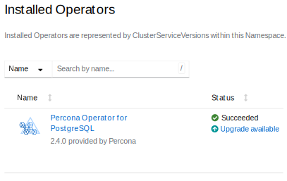

# Upgrade Database and Operator

Starting from the version 2.2.0 Percona Operator for PostgreSQL allows upgrades
to newer 2.x versions.

!!! note

    Upgrading from the 1.x branch of the Operator to 2.x versions ca be done 
    [in several ways](update.md#upgrade-from-the-operator-version-1x-to-version-2x)
    and is completely different from the normal upgrade scenario due to
    substantial changes in the architecture.

Upgrading to a newer version typically involves two steps:

1. Upgrading the Operator and [Custom Resource Definition (CRD) :octicons-link-external-16:](https://kubernetes.io/docs/concepts/extend-kubernetes/api-extension/custom-resources/),
2. Upgrading the Database Management System (Percona Distribution for PostgreSQL).

Alternatively, it is also possible to carry on minor version upgrades of Percona
Distribution for PostgreSQL *without* the Operator upgrade.

## Upgrading the Operator and CRD

The Operator supports only the incremental update to its nearest version (such
as updating the Operator from 2.4.0 to 2.4.1).
To update to a newer version, which differs from the current version by more
than one, make several incremental updates sequentially. For example, to upgrade
the Operator and CRD from the version 2.3.0 to 2.4.1, you need to do the
following sequence of upgrades:

1. upgrading the Operator and CRD from 2.3.0 to 2.3.1,
2. upgrading from 2.3.1 to 2.4.0,
3. upgrading from 2.4.0 to 2.4.1.

You can find Operator versions [listed here](ReleaseNotes/index.md).

!!! note

    The Operator supports **last 3 versions of the CRD**, so it is technically
    possible to skip upgrading the CRD and just upgrade the Operator. If the CRD
    is older than the new Operator version *by no more than three releases*, you
    should be able to continue using the old CRD and even carry on Percona Distribution
    for PostgreSQL minor version upgrades with it. But updating the Operator *and* CRD
    is the **recommended path**.

### Manual upgrade

You can upgrade the Operator and CRD as follows, considering the Operator uses
`postgres-operator` namespace, and you are upgrading to the version {{ release }}.

1. First update the CRD for the Operator, taking it from the official repository on Github (it is important to use `--server-side` flag when applying `deploy/crd.yaml`), and do the same for the Role-based access control. Applying the new CRD manifest must be done with [server-side :octicons-link-external-16:](https://kubernetes.io/docs/reference/using-api/server-side-apply/) flag (otherwise you can encounter a number of errors caused by applying the CRD client-side: the command may fail, the built-in PosgreSQL extensions can be lost during such upgrade, etc.).

    ``` {.bash data-prompt="$" }
    $ kubectl apply --server-side -f https://raw.githubusercontent.com/percona/percona-postgresql-operator/v{{ release }}/deploy/crd.yaml
    $ kubectl apply -f https://raw.githubusercontent.com/percona/percona-postgresql-operator/v{{ release }}/deploy/rbac.yaml -n postgres-operator
    ```
    !!! note

        In case of [cluster-wide installation](cluster-wide.md), use `deploy/cw-rbac.yaml` instead of `deploy/rbac.yaml`.

2. Now you should [Apply a patch :octicons-link-external-16:](https://kubernetes.io/docs/tasks/run-application/update-api-object-kubectl-patch/)
    to your deployment, supplying necessary image name with a newer version tag.
    You can find the proper image names and version tags for the current Operator version [in the list of certified images](images.md).
    For older versions, please refer to the [old releases documentation archive :octicons-link-external-16:](https://docs.percona.com/legacy-documentation/)).
    
    Updating to the `{{ release }}` version should look as follows:

    ``` {.bash data-prompt="$" }
    $ kubectl -n postgres-operator patch deployment percona-postgresql-operator \
       -p'{"spec":{"template":{"spec":{"containers":[{"name":"operator","image":"percona/percona-postgresql-operator:{{ release }}"}]}}}}'
    ```

3. The deployment rollout will be automatically triggered by the applied patch.
    You can track the rollout process in real time with the
    `kubectl rollout status` command with the name of your cluster:

    ``` {.bash data-prompt="$" }
    $ kubectl rollout status deployments percona-postgresql-operator -n postgres-operator
    ```
    
    ??? example "Expected output"

        ``` {.text .no-copy}
        deployment "percona-postgresql-operator" successfully rolled out
        ```

### Upgrade via Helm

If you have [installed the Operator using Helm](helm.md), you can upgrade the
Operator with the `helm upgrade` command.

!!! note

    You can use `helm upgrade` to upgrade the Operator. But the database management system (Percona Distribution for PostgreSQL) should be upgraded in the same way whether you used Helm to install it or not.

1. Update the [Custom Resource Definition :octicons-link-external-16:](https://kubernetes.io/docs/concepts/extend-kubernetes/api-extension/custom-resources/)
    for the Operator, taking it from the official repository on Github, and do
    the same for the Role-based access control:

    ``` {.bash data-prompt="$" }
    $ kubectl apply --server-side -f https://raw.githubusercontent.com/percona/percona-postgresql-operator/v{{ release }}/deploy/crd.yaml
    $ kubectl apply -f https://raw.githubusercontent.com/percona/percona-postgresql-operator/v{{ release }}/deploy/rbac.yaml -n postgres-operator
    ```

2. If you installed the Operator with no [customized parameters :octicons-link-external-16:](https://github.com/percona/percona-helm-charts/tree/main/charts/pg-operator#installing-the-chart), the upgrade can be done as follows: 

    ``` {.bash data-prompt="$" }
    $ helm upgrade my-operator percona/pg-operator --version {{ release }}
    ```

    The `my-operator` parameter in the above example is the name of a [release object :octicons-link-external-16:](https://helm.sh/docs/intro/using_helm/#three-big-concepts)
    which which you have chosen for the Operator when installing its Helm chart.

    If the Operator was installed with some [customized parameters :octicons-link-external-16:](https://github.com/percona/percona-helm-charts/tree/main/charts/pg-operator#installing-the-chart), you should list these options in the upgrade command.   
    
    !!! note
    
        You can get list of used options in YAML format with the `helm get values my-operator -a > my-values.yaml` command, and this file can be directly passed to the upgrade command as follows:

        ``` {.bash data-prompt="$" }
        $ helm upgrade my-operator percona/pg-operator --version {{ release }} -f my-values.yaml
        ```

### Upgrade via Operator Lifecycle Manager (OLM)

If you have [installed the Operator on the OpenShift platform using OLM](openshift.md#install-the-operator-via-the-operator-lifecycle-manager-olm), you can upgrade the Operator within it.

1. List installed Operators for your Namespace to see if there are upgradable items.

    

2. Click the "Upgrade available" link to see upgrade details, then click "Preview InstallPlan" button, and finally "Approve" to upgrade the Operator.

## Upgrading Percona Distribution for PostgreSQL

Before the Operator version 2.4, you could upgrade Percona Distribution for PostgreSQL from one minor version to another (such as upgrading from 15.5 to 15.7, or from 16.1 to 16.3). Starting from the Operator 2.4 you can also upgrade from one PostgreSQL major version to another (for example, upgrade from PostgreSQL 15.5 to PostgreSQL 16.3). Minor version upgrade and major version upgrade are technically different tasks with different scenarios.

!!! note

    Upgrading a PostgreSQL cluster upgrade may result in downtime, as well as [failover](change-primary.md) caused by updating the primary instance.

### Minor version upgrade

Upgrading Percona Distribution for PostgreSQL minor version (for example, 16.1 to 16.3) can be done as follows:

1. [Apply a patch :octicons-link-external-16:](https://kubernetes.io/docs/tasks/run-application/update-api-object-kubectl-patch/)
    to your Custom Resource, setting necessary Custom Resource version and image
    names with a newer version tag.

    !!! note

        Check the version of the Operator you have in your Kubernetes
        environment. Please refer to [the Operator upgrade guide](update.md#upgrading-the-operator-and-crd)
        to upgrade the Operator and CRD first, if needed.

    Patching Custom Resource is done with the `kubectl patch pg` command.
    Actual image names can be found [in the list of certified images](images.md).
    For example, updating `cluster1` cluster to the `{{ release }}` version
    should look as follows:

    ``` {.bash data-prompt="$" }
    $ kubectl -n postgres-operator patch pg cluster1 --type=merge --patch '{
       "spec": {
          "crVersion":"{{ release }}",
          "image": "percona/percona-postgresql-operator:{{ release }}-ppg{{ postgresrecommended }}-postgres",
          "proxy": { "pgBouncer": { "image": "percona/percona-postgresql-operator:{{ release }}-ppg{{ postgresrecommended }}-pgbouncer{{ pgbouncerrecommended }}" } },
          "backups": { "pgbackrest":  { "image": "percona/percona-postgresql-operator:{{ release }}-ppg{{ postgresrecommended }}-pgbackrest{{ pgbackrestrecommended }}" } },
          "pmm": { "image": "percona/pmm-client:{{ pmm2recommended }}" }
       }}'
    ```

    The following image names in the above example were taken from the [list of certified images](images.md):
    
    * `percona/percona-postgresql-operator:{{ release }}-ppg{{ postgresrecommended }}-postgres`,
    * `percona/percona-postgresql-operator:{{ release }}-ppg{{ postgresrecommended }}-pgbouncer{{ pgbouncerrecommended }}`,
    * `percona/percona-postgresql-operator:{{ release }}-ppg{{ postgresrecommended }}-pgbackrest{{ pgbackrestrecommended }}`,
    * `percona/pmm-client:{{ pmm2recommended }}`.

    !!! warning

        The above command upgrades various components of the cluster including PMM Client. It is [highly recommended :octicons-link-external-16:](https://docs.percona.com/percona-monitoring-and-management/how-to/upgrade.html) to upgrade PMM Server **before** upgrading PMM Client. If it wasn't done and you would like to avoid PMM Client upgrade, remove it from the list of images, reducing the last of two patch commands as follows:
    
        ``` {.bash data-prompt="$" }
        $ kubectl -n postgres-operator patch pg cluster1 --type=merge --patch '{
           "spec": {
              "crVersion":"{{ release }}",
              "image": "percona/percona-postgresql-operator:{{ release }}-ppg{{ postgresrecommended }}-postgres",
              "proxy": { "pgBouncer": { "image": "percona/percona-postgresql-operator:{{ release }}-ppg{{ postgresrecommended }}-pgbouncer{{ pgbouncerrecommended }}" } },
              "backups": { "pgbackrest":  { "image": "percona/percona-postgresql-operator:{{ release }}-ppg{{ postgresrecommended }}-pgbackrest{{ pgbackrestrecommended }}" } }
           }}'
        ```

The deployment rollout will be automatically triggered by the applied patch.
The update process is successfully finished when all Pods have been restarted.

``` {.bash data-prompt="$" }
$ kubectl get pods -n postgres-operator
```

??? example "Expected output"

    --8<-- "kubectl-get-pods-response.txt"

### Major version upgrade

Major version upgrade allows you to jump from one database major version to another (for example, upgrade from PostgreSQL 15.5 to PostgreSQL 16.3).

!!! note

    Major version upgrades feature is currently a **tech preview**, and it is **not recommended for production environments.**

    Also, currently the major version upgrade only works if the images in Custom Resource (`deploy/cr.yaml` manifest) are specified without minor version numbers:

    ```yaml
    ...
    image: percona/percona-postgresql-operator:2.4.0-ppg15-postgres
    postgresVersion: 15
    ...
    ```
    
    It will not work for images specified like `percona/percona-postgresql-operator:2.4.0-ppg15.7-postgres`.

The upgrade is triggered by applying the YAML file which refers to the special *Operator upgrade image* and contains the information about the existing and desired major versions. An example of this file is present in `deploy/upgrade.yaml`:

```yaml
apiVersion: pgv2.percona.com/v2
kind: PerconaPGUpgrade
metadata:
  name: cluster1-15-to-16
spec:
  postgresClusterName: cluster1
  image: percona/percona-postgresql-operator:{{ release }}-upgrade
  fromPostgresVersion: 15
  toPostgresVersion: 16
  toPostgresImage: percona/percona-postgresql-operator:{{ release }}-ppg{{ postgres16recommended }}-postgres
  toPgBouncerImage: percona/percona-postgresql-operator:{{ release }}-ppg{{ postgres16recommended }}-pgbouncer{{ pgbouncerrecommended }}
  toPgBackRestImage: percona/percona-postgresql-operator:{{ release }}-ppg{{ postgres16recommended }}-pgbackrest{{ pgbackrestrecommended }}
```

As you can see, the manifest includes image names for the database cluster components (PostgreSQL, pgBouncer, and pgBackRest). You can find them [in the list of certified images](images.md) for the current Operator release. For older versions, please refer to the [old releases documentation archive :octicons-link-external-16:](https://docs.percona.com/legacy-documentation/)).

After you apply the YAML manifest as usual (by running `kubectl apply -f deploy/upgrade.yaml` command), the actual upgrade takes place:

1. The Operator pauses the cluster, so the cluster will be unavailable for the duration of the upgrade,
2. The cluster is specially annotated with `pgv2.percona.com/allow-upgrade`: `<PerconaPGUpgrade.Name>` annotation,
3. Jobs are created to migrate the data,
4. The cluster starts up after the upgrade finishes.

!!! note

    If the upgrade fails for some reason, the cluster will stay in paused mode. Resume the cluster [manually](pause.md) to check what went wrong with upgrade (it will start with the old version). You can check the PerconaPGUpgrade resource with `kubectl get perconapgupgrade -o yaml` command, and [check the logs](debug-logs.md) of the upgraded Pods to debug the issue.

During the upgrade data are duplicated in the same PVC for each major upgrade, and old version data are not deleted automatically. Make sure your PVC has enough free space to store data.
You can remove data at your discretion by [executing into containers](debug-shell.md) and running the following commands (example for PostgreSQL 15):

``` {.bash data-prompt="$" }
$ rm -rf /pgdata/pg15
$ rm -rf /pgdata/pg15_wal
```

You can also delete the `PerconaPGUpgrade` resource (this will clean up the jobs and Pods created during the upgrade):

``` {.bash data-prompt="$" }
$ kubectl delete perconapgupgrade cluster1-15-to-16
```

If there are [custom PostgreSQL extensions](custom-extensions.md) installed in the cluster, they need to be taken into account: you need to build and package each custom extension for the new PostgreSQL major version. During the  upgrade the Operator will install extensions into the upgrade container.

## Upgrade from the Operator version 1.x to version 2.x

The Operator version 2.x has a lot of differences compared to the version 1.x.
This makes upgrading from version 1.x to version 2.x quite different from a normal upgrade. In fact, you have to migrate the cluster from version 1.x to version 2.x.

There are several ways to do such version 1.x to version 2.x upgrade. Choose the method based on your downtime preference and roll back strategy:

|                                                                                                                     | Pros                | Cons        |
| --------------------------------------------------------------------------------------------------------------------| --------------------| ------------|
| [Data Volumes migration](update-data-volumes.md) - re-use the volumes that were created by the Operator version 1.x | The simplest method | - Requires downtime <br> - Impossible to roll back |
| [Backup and restore](update-backup-restore.md) - take the backup with the Operator version 1.x and restore it to the cluster deployed by the Operator version 2.x | Allows you to quickly test version 2.x | Provides significant downtime in case of migration |
| [Replication](update-standby.md) - replicate the data from the Operator version 1.x cluster to the standby cluster deployed by the Operator version 2.x | - Quick test of v2 cluster <br> - Minimal downtime during upgrade | Requires significant computing resources to run two clusters in parallel | 

